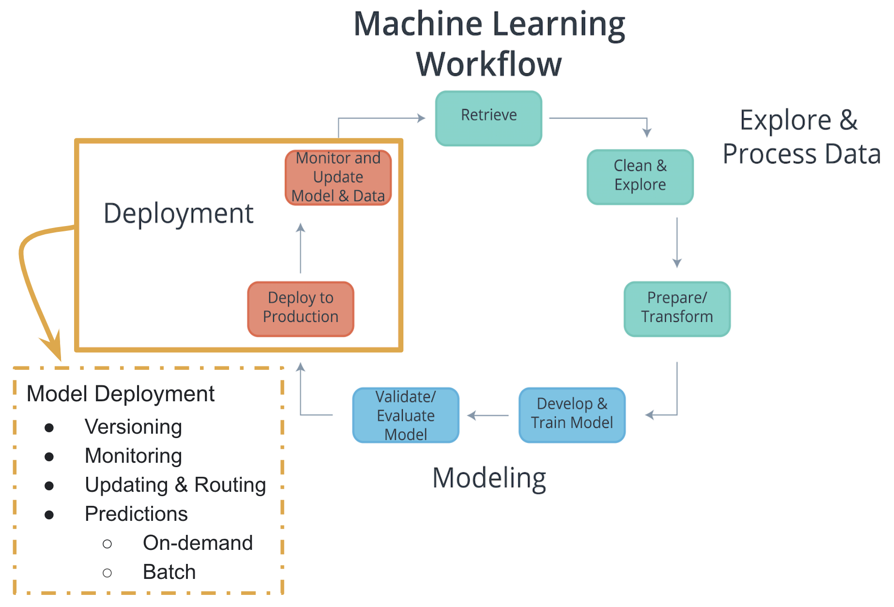

# What's ahead
In this lesson, you're going to get familiar with what's meant by _machine learning deployment_.

Specifically, we will look at answering the following questions:

1. What's the machine learning workflow?
2. How does deployment fit into the machine learning workflow?
3. What is cloud computing?
4. Why would we use cloud computing for deploying machine learning models?
5. Why isn't deployment a part of many machine learning curriculums?
6. What does it mean for a model to be deployed?
7. What are the essential characteristics associated with the code of deployed models?
8. What are different cloud computing platforms we might use to deploy our machine learning models?

# Machine Learning Workflow

Deployment is the last part of a development cycle, where we make our model available to a software or a web application.

# Cloud Computing
## What is cloud computing?
Transforming an _Information Technology (IT) product_ into a _service_.

## Why would a business decide to use cloud computing?
Most of the factors related to choosing _cloud computing services_, instead of developing _on-premise IT resources_ are related to **_time_** and **_cost_**.

### Benefits
1. Reduced Investments and Proportional Costs (providing cost reduction)
2. Increased Scalability (providing simplified capacity planning)
3. Increased Availability and Reliability (providing organizational agility)
### Risks
1. (Potential) Increase in Security Vulnerabilities
2. Reduced Operational Governance Control (over cloud resources)
3. Limited Portability Between Cloud Providers
4. Multi-regional Compliance and Legal Issues
### Other resources
- [National Institute of Standards and Technology](https://www.nist.gov/) formal definition of [Cloud Computing](https://csrc.nist.gov/publications/detail/sp/800-145/final).
- [Amazon Web Services](https://aws.amazon.com/)(AWS) discusses their definition of [Cloud Computing](https://aws.amazon.com/what-is-cloud-computing/)
- [Google Cloud Platform](https://cloud.google.com/)(GCP) discusses their definition of [Cloud Computing](https://cloud.google.com/what-is-cloud-computing/)
- [Microsoft Azure](https://azure.microsoft.com/en-us/)(Azure) discusses their definition of [Cloud Computing](https://azure.microsoft.com/en-us/overview/what-is-cloud-computing/)

## Machine Learning Applications
For **_personal use_**, one’s _likely_ to use cloud services, if they don’t have enough computing capacity.
With **_academic use_**, quite often one will use the university’s on-premise computing resources, given their availability. For smaller universities or research groups with few funding resources, _cloud services_ might offer a viable alternative to university computing resources.
For *_workplace usage_*, the amount of _cloud resources_ used depends upon an organization’s existing infrastructure and their vulnerability to the risks of cloud computing. A workplace may have security concerns, operational governance concerns, and/or compliance and legal concerns regarding _cloud usage_. Additionally, a workplace may already have on-premise infrastructure that supports the workflow; therefore, making _cloud usage_ an unnecessary expenditure. Keep in mind, many progressive companies may be incorporating _cloud computing_ into their business due to the business drivers and benefits of cloud computing.

## Paths to Deployment
### Deployment to Production
**Recall that:**
**_Deployment to production_** can simply be thought of as a method that integrates a machine learning model into an existing production environment so that the model can be used to make _decisions_ or _predictions_ based upon _data input_ into the model.
### Paths to deployment
From **_least_** to **_most_** _commonly_ used:
1. Python model is _recoded_ into the programming language of the production environment: Usually rewrite Python model to Java or C++ (for example). Rarely used because it takes time to recode, test and validate the model that provides the _same_ predictions as the _original_.
2. Model is _coded_ in _Predictive Model Markup Language_ (PMML) or _Portable Format Analytics_ (PFA): These are two complementary standards that _simplify_ moving predictive models to _deployment_ into a _production environment_. The Data Mining Group developed both PMML and PFA to provide vendor-neutral executable model specifications for certain predictive models used by data mining and machine learning. Certain analytic software allow for the direct import of PMML, such as IBM SPSS, R, SAS Base & Enterprise Miner, Apache Spark, Teradata Warehouse Miner, and TIBCO Spotfire.
3. Python model is _converted_ into a format that can be used in the production environment: _use libraries_ and _methods_ that _convert_ the model into **_code_** that can be used in the _production environment_. Most popular ML software frameworks (e.g. PyTorch, SciKit-Learn, TensorFlow) have methods that convert Python models into _intermediate standard format_, like ONNX ([Open Neural Network Exchange](https://onnx.ai/) format). This intermediate format can be converted into the software native to the production environment.
  - This is the _easiest_ and _fastest_ way **_to move_** a Python model from _modeling_ directly to _deployment_.
  - Moving forward, this is _tipically_ the way _models_ are **_moved_** into the _production environment_
  - Technologies like _containers_, _endpoints_, and _APIs_ also help **_ease_** the **_work_** required for _deploying_ a model into the _production environment_.
The **_third_** _method_ that's _most_ similar to what’s used for _deployment_ within **_Amazon’s SageMaker_**.

## Production Environments

## Rest APIs
### Model, Application, and Endpoint

One way to think of the **_endpoint_** that acts as this _interface_, is to think of a _Python program_ where:
- the **endpoint** itself is like a **_function call_**
- the **_function_** itself would be the **model** and
- the **_Python program_** is the **application**.

### Endpoint and REST API
Communication between the **application** and the **model** is done through the **endpoint** (_interface_), where the **endpoint** is an **Application Programming Interface** (**API**).
- An easy way to think of an **API**, is as a set of rules that enable programs, here the **application** and the **model**, to _communicate_ with each other.
- In this case, our **API** uses a **RE**presentational **S**tate **T**ransfer, **REST**, architecture that provides a framework for the _set of rules_ and _constraints_ that must be adhered to for _communication_ between programs.
- This **REST API** is one that uses _HTTP requests_ and _responses_ to enable communication between the **application** and the **model** through the **endpoint** (_interface_).
- Noting that _both_ the **HTTP request** and **HTTP response** are _communications_ sent between the **application** and **model**.

The **HTTP request** that is sent from your **application** to your **model** is composed of _four_ parts:
- **Endpoint**:
  - This **endpoint** will be in the form of a URL, Uniform Resource Locator, which is commonly know as a web address.
- HTTP Method:
  - There are _four_ main **HTTP methods**, but for purposes of **_deployment_** our **application** will use the **_POST method_** _only_.
    - **GET**: _READ_. This request is used to retrieve information. If the information is found, it is sent back as the response.
    - **POST**: _CREATE_. This request is used to create new information. Once a new entry is created, it tis sent back as the response.
    - **PUT**: _UPDATE_. This request is used to update information. The PATCH method also updates information, but it is only a partial update with PATCH.
    - **DELETE**: _DELETE_. This request is used to delete information.

The **HTTP response** sent from your model to your application is composed of _three_ parts:
- HTTP Status Code
  - If the model succesfully received and processed the _user's data_ that was sent in the **message**, the status code should start with a **_2_**, like _200_.
  - HTTP Headers
    - The **headers** will contain additional information, like the format of the data within the **message**, that's passed to the receiving program.
  - Message (Data or Body)
    - What's returned as the _data_ within the **message** is the _prediction_ that's provided by the **model**.

This _prediction_ is then presented to the _application user_ through the **application**. The **endpoint** is the **_interface_** that _enables communication_ between the **application** and the **model** using a **REST API**.
As we learn more about **REST****_ful_** **API**, realize that it's the **application’s** responsibility:
  - To format the _user’s data_ in a way that can be easily put into the **HTTP request** _message_ and _used_ by the **model**.
  - To translate the _predictions_ from the **HTTP response** _message_ in a way that’s easy for the _application user’s_ to understand.
Notice the following regarding the information included in the **_HTTP messages_** sent between **application** and **model**:
  - Often _user's data_ will need to be in a _CSV_ or _JSON_ format with a specific _ordering_ of the data that's dependent upon the **model** used.
  - Often _predictions_ will be returned in _CSV_ or _JSON_ format with a specific _ordering_ of the returned _predictions_ dependent upon the **model** used.

## Containers

### Model, Application, and Containers
When we discussed the production environment, it was composed of two primary programs, the **model** and the **application**, that communicate with each other through the **endpoint** (_interface_).

- The **model** is simply the _Python model_ that's created, trained, and evaluated in the **_Modeling_** component of the _machine learning workflow_.
- The **application** is simply a _web_ or _software application_ that _enables_ the application users to use the _model_ to retrieve _predictions_.

Both the **model** and the **application** require a _computing environment_ so that they can be run and available for use. One way to _create_ and _maintain_ these _computing environments_ is through the use of **_containers_**.

- Specifically, the **model** and the **application** can each be run in a **_container_** _computing environment_. The **_containers_** are created using a **_script_** that contains instructions on which software packages, libraries, and other computing attributes are needed in order to run a _software application_, in our case either the **model** or the **application**.

### Containers Defined
- A **_container_** can be thought of as a _standardized collection/bundle of software_ that is to be _used_ for the specific purpose of _running an application_.

As stated above **_container_** technology is _used to create_ the **model** and **application** _computational environments_ associated with **_deployment_** in machine learning. A common **container** software is _Docker_. Due to its popularity sometimes _Docker_ is used synonymously with **containers**.

### Containers Explained
Often to first explain the concept of **_containers_**, people tend to use the analogy of how Docker _containers_ are similar to shipping containers.

- Shipping containers can contain a wide variety of products, from food to computers to cars.
- The structure of a shipping container provides the ability for it to hold _different types_ of products while making it easy to track, load, unload, and transport products worldwide within a shipping container.

Similarly _Docker_ **_containers_**:

- Can _contain_ **_all_** types of _different_ software.
- The structure of a _Docker_ **container** enables the **container** to be _created_, _saved_, _used_, and _deleted_ through a set of _common tools_.
- The _common tool set_ works with **_any_** **container** regardless of the software the **container** contains.

### Container Structure
The image **below** shows the basic structure of a **container**, you have:

- The underlying _computational infrastructure_ which can be: a cloud provider’s data center, an on-premise data center, or even someone’s local computer.
- Next, you have an _operating system_ running on this computational infrastructure, this could be the operating system on your local computer.
- Next, there’s the _container engine_, this could be _Docker_ software running on your local computer. The _container engine_ software enables one to create, save, use, and delete containers; for our example, it could be _Docker_ running on a local computer.
- The final two layers make up the composition of the _containers_.
  - The first layer of the container is the _libraries and binaries_ required to launch, run, and maintain the _next_ layer, the _application_ layer.
- The image **below** shows _three_ containers running _three_ different applications.

This _architecture_ of **containers** provides the following _advantages_:

1. Isolates the application, which _increases_ security.

2. Requires _only_ software needed to run the application, which uses computational resources _more efficiently_ and allows for faster application deployment.

3. Makes application creation, replication, deletion, and maintenance easier and the same across all applications that are deployed using containers.

4. Provides a more simple and secure way to replicate, save, and share containers.

As indicated by the **_fourth_** _advantage_ of using **_containers_**, a **_container_** _script file_ is used to create a **_container_**.

- This _text script file_ can easily be shared with others and provides a simple method to _replicate_ a particular **_container_**.
- This **_container_** _script_ is simply the _instructions_ (_algorithm_) that is used to create a **_container_**; for _Docker_ these **_container_** _scripts_ are referred to as _dockerfiles_.

This is shown with the image **below**, where the **_container_** _engine_ uses a **_container_** _script_ to create a **_container_** for an application to run within. These **_container_** _script files_ can be stored in repositories, which provide a simple means to share and replicate **_containers_**. For _Docker_, the [Docker Hub](https://hub.docker.com/explore/) is the official repository for storing and sharing _dockerfiles_. Here's an example of a [dockerfile](https://github.com/pytorch/pytorch/blob/master/docker/pytorch/Dockerfile) that creates a docker container with Python 3.6 and PyTorch installed.

##  Characteristics of Deploying and Modeling
#### Recall that:
- **_Deployment_** to production can simply be thought of as a _method_ that _integrate_ a machine learning **model** into an _existing_ **production environment** so that the **model** can be used to make _decisions_ or _predictions_ based upon _data_ input into this **model**.
- Also remember that a **_production environmen_t** can be thought of as a _web_, _mobile_, or _other software_ **application** that is _currently_ being _used_ by _many_ people and must respond _quickly_ to those users’ requests.

Keeping these things in mind, there are a number of _characteristics_ of **deployment** and **modeling** that I’m going to introduce here. These concepts are introduced _now_ to provide you with _familiarity_ with these concepts for when you see them discussed in _future lessons_. Specifically, these concepts are provided as **_features_** that are made easier to use within cloud platforms services than if implemented with your own code.

### Characteristics of Modeling

#### Hyperparameters
In machine learning, a **hyperparameter** is a parameter whose value _cannot_ be estimated from the data.

- Specifically, a **hyperparameter** is _not directly_ learned through the estimators; therefore, their value must be _set_ by the model developer.
- This means that **hyperparameter** _tuning_ for optimization is an **_important part_** of _model training_.
- Often cloud platform machine learning services provide methods that allow for **automatic hyperparameter** _tuning_ for use with model training.

If the machine learning platform fails to offer an _automatic_ **hyperparameter** option, one option is to use methods from scikit-learn Python library for **hyperparameter** _tuning_. [Scikit-learn](https://scikit-learn.org/stable/) is a free machine learning Python library that includes _methods_ that help with [hyperparameter tuning](https://scikit-learn.org/stable/modules/grid_search.html#).

### Characteristics of Deployment
#### Model Versioning
One characteristic of deployment is the **version** of the model that is to be deployed.
- Besides saving the **model version** as a part of a _model’s metadata_ in a database, the _deployment platform_ should allow one to indicate a deployed **model’s version**.
This will make it easier to maintain, monitor, and update the deployed model.

### Model Monitoring
Another characteristic of deployment is the ability to easily **monitor** your deployed models.
- Once a model is deployed you will want to make certain it continues to meet its performance metrics; otherwise, the application may need to be updated with a _better_ performing model.

### Model Updating and Routing
The ability to easily **update** your deployed model is another characteristic of deployment.
- If a deployed model is _failing_ to meet its performance metrics, it's likely you will need to **update** this model.
If there's been a _fundamental change_ in the _data_ that’s being input into the model for predictions; you'll want to **collect** this _input data_ to be used to **update** the model.
- The _deployment platform_ should support **routing** _differing_ proportions of _user requests_ to the deployed models; to allow _comparison_ of performance between the deployed model _variants_.
**Routing** in this way allows for a test of a model _performance_ as _compared_ to other model _variants_.

### Model Predictions
Another characteristic of deployment is the _type_ of **predictions** provided by your deployed model. There are _two common_ types of **predictions**:
- **On-demand predictions**
- **Batch predictions**

### On-Demand Predictions
- **On-demand predictions** might also be called:
  - online,
  - real-time, or
  - synchronous predictions
- With these type of predictions, one expects:
  - a low latency of response to each prediction request,
  - but allows for possibility high variability in request volume.
- Predictions are returned in the response from the request. Often these requests and responses are done through an API using JSON or XML formatted strings.
- Each prediction request from the user can contain one or many requests for predictions. Noting that many is limited based upon the size of the data sent as the request. Common cloud platforms **on-demand prediction** request size limits can range from 1.5(ML Engine) to 5 Megabytes (SageMaker).
**On-demand predictions** are commonly used to provide customers, users, or employees with real-time, online responses based upon a deployed model. Thinking back on our magic eight ball web application example, users of our web application would be making **on-demand prediction** requests.

### Batch Predictions
- **Batch predictions** might also be _called_:
  - asynchronous, or
  - batch-based predictions.
- With these type of predictions, one _expects_:
  - _high volume_ of requests with more _periodic submissions_
  - so _latency_ won’t be an issue.
- Each batch request will point to specifically _formatted data file_ of requests and will return the predictions to a file. Cloud services **_require_** these files will be _stored_ in the cloud provider’s cloud.
- Cloud services typically have _limits_ to how much data they can process with each batch request based upon _limits_ they impose on the _size of file_ you can store in their cloud storage service. For example, _Amazon’s SageMaker_ limits batch predictions requests to the size limit they enforce on an object in their S3 storage service.
**Batch predictions** are _commonly_ used to help make _business decisions_. For example, imagine a business uses a complex model to predict customer satisfaction across a number of their products and they need these _estimates_ for a _weekly_ report. This would require processing customer data through a **batch prediction** request on a _weekly basis_.

# Comparing Cloud Providers
## Machine Learning Cloud Platforms
There are a number of machine learning cloud platforms, we provide _more_ details about a _few_ **below**. In the _next_ few lessons, you will learn how to use **Amazon's SageMaker** to _deploy_ machine learning models. Therefore, we _focused_ on providing _more_ information on **[Amazon's SageMaker](https://aws.amazon.com/sagemaker/)**. To allow for a comparison of features offered by [SageMaker](https://aws.amazon.com/sagemaker/), we also provide detailed information about [Google's ML Engine](https://cloud.google.com/ml-engine/) because it's _most_ similar to **SageMaker**.

## Amazon Web Services (AWS)
[Amazon Web Services (AWS) SageMake](https://aws.amazon.com/sagemaker/) is Amazon's cloud service that allows you to _build_, _train_, and _deploy_ machine learning models. Some advantages to using Amazon's SageMaker service are the following:

- **Flexibility in Machine Learning Software**: [SageMaker](https://aws.amazon.com/sagemaker/) has the flexibility to enable the use of **_any_** programming language or software framework for building, training, and deploying machine learning models in **AWS**. For the details see the three methods of modeling within **SageMaker below**.
  - **[Built-in Algorithms](https://docs.aws.amazon.com/sagemaker/latest/dg/algos.html)** - There are at least fifteen built-in algorithms that are easily used within SageMaker. Specifically, built-in algorithms for discrete classification or quantitative analysis using [linear learner](https://docs.aws.amazon.com/sagemaker/latest/dg/linear-learner.html) or [XGBoost](https://docs.aws.amazon.com/sagemaker/latest/dg/xgboost.html), item recommendations using [factorization machine](https://docs.aws.amazon.com/sagemaker/latest/dg/fact-machines.html), grouping based upon attributes using [K-Means](https://docs.aws.amazon.com/sagemaker/latest/dg/k-means.html), an algorithm for [image classification](https://docs.aws.amazon.com/sagemaker/latest/dg/image-classification.html), and many other algorithms.
  - **Custom Algorithms** - There are different programming languages and software frameworks that can be used to develop custom algorithms which include: [PyTorch](https://docs.aws.amazon.com/sagemaker/latest/dg/pytorch.html), [TensorFlow](https://docs.aws.amazon.com/sagemaker/latest/dg/tf.html), [Apache MXNet](https://docs.aws.amazon.com/sagemaker/latest/dg/apache-spark.html), [Apache Spark](https://docs.aws.amazon.com/sagemaker/latest/dg/apache-spark.html), and [Chainer](https://docs.aws.amazon.com/sagemaker/latest/dg/chainer.html).
  - **[Your Own Algorithms](https://docs.aws.amazon.com/sagemaker/latest/dg/your-algorithms.html)** - Regardless of the programming language or software framework, you can use your own algorithm when it **isn't** included within the _built-in_ or _custom algorithms_ **above**.
- **Ability to Explore and Process Data within SageMaker**: [SageMaker](https://aws.amazon.com/sagemaker/) enables the use of [Jupyter Notebooks](https://docs.aws.amazon.com/sagemaker/latest/dg/nbi.html) to explore and process data, along with creation, training, validation, testing, and deployment of machine learning models. This notebook interface makes data exploration and documentation easier.
- **Flexibility in Modeling and Deployment**: [SageMaker](https://aws.amazon.com/sagemaker/) provides a number of features and automated tools that make **_modeling_** and **_deployment_** easier. For the details on these features within SageMaker see below.
  - **[Automatic Model Tuning](https://docs.aws.amazon.com/sagemaker/latest/dg/automatic-model-tuning.html)**: [SageMaker](https://aws.amazon.com/sagemaker/) provides a feature that allows hyperparameter tuning to find the best version of the model for _built-in_ and _custom algorithms_. For built-in algorithms SageMaker also provides evaluation metrics to evaluate the performance of your models.
  - **[Monitoring Models](https://docs.aws.amazon.com/sagemaker/latest/dg/monitoring-overview.html)**: [SageMaker](https://aws.amazon.com/sagemaker/) provides features that allow you to monitor your _deployed_ models. Additionally with _model deployment_, one can choose how much traffic to route to each deployed model (model variant). More information on routing traffic to model variants can be found here and here .
  - **Type of Predictions**: SageMaker by _default_ allows for [On-demand](https://docs.aws.amazon.com/sagemaker/latest/dg/ex1-test-model.html) type of predictions where _each_ prediction _request_ can contain _one_ to _many_ requests. SageMaker also allows for [Batch](https://docs.aws.amazon.com/sagemaker/latest/dg/how-it-works-batch.html) predictions, and request _data_ size limits are based upon S3 object size limits.

## Google Cloud Platform (GCP)

[Google Cloud Platform (GCP) ML Engine](https://cloud.google.com/ml-engine/) is Google's cloud service that allows you to _build_, _train_, and _deploy_ machine learning models. Below we have highlighted some of the **_similarities_** and **_differences_** between these two cloud service platforms.

- **Prediction Costs**: The **_primary difference_** between the two is how they handle predictions. With **_SageMaker_** _predictions_, you must leave resources running to provide predictions. This enables _less_ latency in providing predictions at the _cost_ of paying for running _idle_ services, if there are no (or few) prediction requests made while services are running. With **_ML Engine_** _predictions_, one has the option to _not_ leave resources running which reduces cost associated with _infrequent_ or _periodic_ requests. Using this has _more_ latency associated with predictions because the resources are in a offline state until they receive a prediction request. The _increased_ latency is associated to bringing resources back online, but one _only_ pays for the time the resources are _in use_. To see more about [ML Engine pricing](https://cloud.google.com/ml-engine/docs/pricing#node-hour) and [SageMaker pricing](https://cloud.google.com/ml-engine/docs/pricing#node-hour).

- **Ability to Explore and Process Data**: Another **_difference_** between **ML Engine** and **SageMaker** is the fact that _Jupyter Notebooks_ are not available within **ML Engine**. To use _Jupyter Notebooks_ within **Google's Cloud Platform** (GCP), one would use [Datalab](https://cloud.google.com/datalab/docs/). **GCP** separates data exploration, processing, and transformation into other services. Specifically, [Google's Datalab](https://cloud.google.com/datalab/docs/) can be used for data exploration and data processing, [Dataprep](https://cloud.google.com/dataprep/docs/) can be used to explore and transform raw data into clean data for analysis and processing, and [DataFlow](https://cloud.google.com/dataflow/docs/) can be used to deploy batch and streaming data processing pipelines. Noting that **Amazon Web Services** (AWS), also have data processing and transformation pipeline services like [AWS Glue](https://aws.amazon.com/glue/) and [AWS Data Pipeline](https://aws.amazon.com/datapipeline/).

- **Machine Learning Software**: The final **_difference_** is that [Google's ML Engine](https://cloud.google.com/ml-engine/) has _less_ flexibility in available software frameworks for building, training, and deploying machine learning models in **GCP** as compared to **Amazon's SageMaker**. For the details regarding the two available software frameworks for modeling within **ML Engine** see **below**.

    - [Google's TensorFlow](https://cloud.google.com/ml-engine/docs/tensorflow/) is an open source machine learning framework that was originally developed by the Google Brain team. [TensorFlow](https://www.tensorflow.org/) can be used for creating, training, and deploying machine learning and deep learning models. [Keras](https://keras.io/) is a higher level API written in Python that runs on top of [TensorFlow](https://www.tensorflow.org/), that's easier to use and allows for faster development. GCP provides both [TensorFlow examples](https://cloud.google.com/ml-engine/docs/tensorflow/samples) and a [Keras example](https://cloud.google.com/ml-engine/docs/tensorflow/samples#census-keras).

    - [Google's Scikit-learn](https://cloud.google.com/ml-engine/docs/scikit/) is an open source machine learning framework in Python that was originally developed as a Google Summer of Code project. [Scikit-learn](https://cloud.google.com/ml-engine/docs/scikit/) and an [XGBoost Python package](https://xgboost.readthedocs.io/en/latest/python/index.html) can be used together for creating, training, and deploying machine learning models. In the in [Google's example](https://cloud.google.com/ml-engine/docs/scikit/training-xgboost), [XGBoost](https://xgboost.readthedocs.io/en/latest/python/index.html) is used for modeling and [Scikit-learn](https://cloud.google.com/ml-engine/docs/scikit/) is used for processing the data.

- **Flexibility in Modeling and Deployment**: [Google's ML Engine](https://cloud.google.com/ml-engine/) provides a number of features and automated tools that make **_modeling_** and **_deployment_** easier, **_similar_** to the those provided by **Amazon's SageMaker**. For the details on these features within **ML Engine** see **below**.
    - [Automatic Model Tuning](https://cloud.google.com/ml-engine/docs/tensorflow/hyperparameter-tuning-overview): [Google's ML Engine](https://cloud.google.com/ml-engine/) provides a feature that enables hyperparameter tuning to find the **best** version of the model.
    - [Monitoring Models](https://cloud.google.com/ml-engine/docs/tensorflow/monitor-training): [Google's ML Engine](https://cloud.google.com/ml-engine/) provides features that allow you to monitor your models. Additionally [ML Engine](https://cloud.google.com/ml-engine/) provides methods that enable [managing runtime versions](https://cloud.google.com/ml-engine/docs/tensorflow/versioning) and [managing models and jobs](https://cloud.google.com/ml-engine/docs/tensorflow/managing-models-jobs).
    - **Type of Predictions**: [ML Engine](https://cloud.google.com/ml-engine/) allows for [Online](https://cloud.google.com/ml-engine/docs/tensorflow/online-predict)(_or On-demand_) type of predictions where _each_ prediction _request_ can contain _one_ to _many_ requests. **ML Engine** also allows for [Batch](https://cloud.google.com/ml-engine/docs/tensorflow/batch-predict) predictions. More information about **ML Engine's** [Online and Batch predictions](https://cloud.google.com/ml-engine/docs/tensorflow/online-vs-batch-prediction).

## Microsoft Azure
Similar to [Amazon's SageMaker](https://aws.amazon.com/sagemaker/) and [Google's ML Engine](https://cloud.google.com/ml-engine/), Microsoft offers [Azure AI](https://azure.microsoft.com/en-us/overview/ai-platform/#platform). **Azure AI** offers an open and comprehensive platform that includes AI software frameworks like: [TensorFlow](https://www.tensorflow.org/), [PyTorch](https://pytorch.org/), [scikit-learn](http://scikit-learn.org/stable/), [MxNet](https://mxnet.incubator.apache.org/), [Chainer](https://chainer.org/), [Caffe2](https://caffe2.ai/), and other software like their [Azure Machine Learning Studio](https://azure.microsoft.com/en-us/services/machine-learning-studio/). For more details see [Azure AI](https://azure.microsoft.com/en-us/overview/ai-platform/#platform) and [Azure Machine Learning Studio](https://azure.microsoft.com/en-us/services/machine-learning-studio/).

## Paperspace
[Paperspace](https://www.paperspace.com/ml) simply provides GPU-backed virtual machines with industry standard software tools and frameworks like: [TensorFlow](https://www.tensorflow.org/), [Keras](https://keras.io/), [Caffe](http://caffe.berkeleyvision.org/), and [Torch](http://torch.ch/) for machine learning, deep learning, and data science. **Paperspace** claims to provide more powerful and less expensive virtual machines than are offered by **AWS**, **GCP**, or **Azure**.

## Cloud Foundry
[Cloud Foundry](https://www.cloudfoundry.org/) is an open source cloud application platform that's backed by companies like: Cisco, Google, IBM, Microsoft, SAP, and more. [Cloud Foundry](https://www.cloudfoundry.org/) provides a faster and easier way to build, test, deploy, and scale applications by providing a choice of clouds, developer frameworks, and applications services to it's users. [Cloud Foundry Certified Platforms](https://www.cloudfoundry.org/certified-platforms/) provide a way for an organization to have their cloud applications portable across platforms including [IBM](https://www.ibm.com/cloud/cloud-foundry) and [SAP](https://cloudplatform.sap.com/index.html) cloud platforms.

### Summary
Let's summarize the ideas covered in this lesson to ensure you are leaving with the **_most_** important parts!
Specifically in this lesson, we looked at answering the following questions:
1. What is the **_machine learning workflow_**?
2. How does **_deployment_** fit into the machine learning workflow?
3. What is **_cloud computing_**?
4. Why would we use _cloud computing_ for **_deploying machine learning_** models?
5. Why isn't **_deployment_** a part of many _machine learning curriculums_?
6. What does it mean for a model to be **_deployed_**?  
7. What are the **_crucial characteristics_** associated with **_deploying_** models?      
8. What are _different_ **_cloud computing platforms_** we might use to **_deploy_** our _machine learning models_?

# Cloud Computing Defined

The following content is **optional**, it's provided to give students a greater understanding of cloud computing if they are interested in learning more.

* * *

## Cloud Computing Defined by Cloud Providers and References

**_Cloud computing_** was first formally defined by the National Institute of Standards and Technology (NIST) using service models, deployment models, and essential characteristics (see **1** in **References**). Using this formal definition, authors Thomas Erl and Michael Kavis explained in more detail cloud computing, its service models, its deployment models, and its essential characteristics in their books (see **2** & **3** in **References**). Cloud providers Amazon, Google, and Microsoft also provide more modern and evolving explanations of cloud computing, its service models, its deployment models, and its essential characteristics (see **4**, **5**, & **6** in **References**). The information found in this section is based upon the materials that we have included in the **References** at the end of this section.

## Defining Cloud Computing

### _Recall_ the Cloud Computing Example

Where we stored our vacation photos in the **_cloud_** using a _cloud storage provider_, like: [Google Drive](https://www.google.com/drive/), [Apple’s iCloud](https://www.apple.com/icloud/), or [Microsoft’s OneDrive](https://onedrive.live.com/about/en-us/), instead of storing them on a _flash drive_.

With this example, we demonstrated that **cloud computing** can simply be thought of as transforming an _Information Technology (IT) product_ into a _service_. With our vacation photos example, we transformed storing photos on an _IT product_, the **_flash drive_**; into storing them _using a service_, like **_Google Drive_**.

The vacation photo example illustrates _how_ **_cloud storage service_** provides the **_benefits_** of making it _easier to access_ and _share_ our photos. In general, most of the factors related to choosing _cloud computing services_, instead of _developing on-premise IT resources_ are associated with **_benefits_** related to **_time_** and **_cost_**.

**Below** we will explain in detail the formal definition of **cloud computing**.

NIST Cloud Computing Definition

In 2011, the National Institute of Standards and Technology (NIST) defined cloud computing using service models, deployment models, and essential characteristics.

While you have already learned that **cloud computing** is thought of as _transforming_ an **_IT product_**, a _flash drive_, into a **_cloud service_**, _Google Drive_; next we take a more detailed look at cloud computing.

## Service Models of Cloud Computing

Let’s begin by discussing the _three_ **_service models_** of cloud computing.

NIST Cloud Computing - Service Models

### Software as a Service

Starting with _Software as a Service_, SaaS, we’ll use the following graphic to depict the components that compose each of the three service models. The graphic shows whose responsibility it is to create, customize, and maintain the components. The yellow dashed line in the graphic shows with SaaS, the only customer responsibilities are those attributed to a “user” of the service and all other responsibilities are placed upon the cloud provider.

Service Models - SaaS

Software as a product is becoming more rare these days. It used to be that productivity software, like Microsoft Office, was loaded from a physical CD; now you can use applications like Google docs to write, edit, share, and store documents using cloud infrastructure.

Google docs is one example of _Software as a Service_. Some other examples of SaaS are email applications like gmail and hotmail, and storage applications like iCloud or OneDrive.

With SaaS, a cloud provider’s application that’s running on cloud infrastructure is provided to customers as a service. The customer’s responsibility is only to maintain their user account which typically includes: registration, login, administration, and customization of the software application they’re using as a service.

### Platform as a Service

With _Platform as a Service_, PaaS, the yellow dashed line demonstrates that the customer gains additional responsibilities that are associated with managing all applications and data, such as including a user interface and dashboard, security, logs, and other features associated to the data and applications.

Service Models - PaaS

Some examples of _Platform as a Service_, are Heroku and Engine Yard. These services allow users to easily build, host, monitor, and scale their applications using their platform. For example, you might use Heroku to build and host an e-commerce website. Google’s App Engine is a similar PaaS for application development and deployment. The creator of “Angry Birds”, Rovio, used Google App Engine to create an online versions of their game.

With PaaS, the service provided to the customer is the ability to deploy customer-created or customer-acquired applications using the cloud provider’s platform. If you are interested in learning more about Rovio’s story using the _Platform as a Service_, Google App Engine, click on the following [link](https://cloud.google.com/customers/rovio/).

### Infrastructure as a Service

With the service model _Infrastructure as a Service_, IaaS, as shown with the yellow dashed line; the customer has most of the responsibility beyond those associated with running secure data centers and maintaining the hardware and software that enables IaaS.

Service Models - IaaS

Some examples of IaaS are Amazon Web Services and Rackspace, which were among the first to offer _Infrastructure as a Service_ that allowed their customers to use virtual machines.

Essentially a virtual machine is similar to a laptop or desktop computer, except it’s offered as a cloud service; requiring the user to login to their virtual machine through an internet connection.

IaaS enables the customer to provisioning computer processing, storage, networks, and other fundamental computing resources, where the consumer can deploy and run software using the provider’s cloud infrastructure.

Although Amazon, Microsoft, and Google all offer IaaS, they also offer other services that fall within the services models Platform and Software "-as-a-service". While you’re likely using “software-as-a-service” for your email, now that you understand the service models, consider expanding your usage of cloud to platform and infrastructure “as-a-service”.

### Service Models Importance

All three service models provide access to greater computing capability and resources for an affordable price.  
With Google App engine you could build the next popular online game, like Angry Birds, or use Amazon’s Virtual Machine service to have access to a more powerful computer instead of upgrading your own.

# Cloud Computing Explained

The following content is **optional**, it's provided to give students a greater understanding of cloud computing if they are interested in learning more.

* * *

## Cloud Computing Drivers, Benefits, and Risks provided by Cloud Providers and References

The _capacity utilization_ graphic that you will see in this section was originally presented by AWS in 2012 to help explain the benefits of cloud computing. As usage of cloud computing has become more ubiquitous in recent years, cloud providers Amazon, Google, and Microsoft have evolving benefits and improved security within their cloud services (see **3**, **4**, & **5** in **References**). Authors Thomas Erl and Michael Kavis explained in more detail the business drivers, benefits, and risks of cloud computing in their books (see **1** & **2** in **References**). The information found in this section is based upon the materials that we have included in the **References** at the end of this section.

### _Recall_ why businesses decide to use cloud computing

Remember that most of the factors related to choosing _cloud computing services_, instead of _developing on-premise IT resources_ are related to **_time_** and **_cost_**. Below we have an example that explains _why_ startups use cloud services.

Imagine it’s 2010 and you created a photo-sharing application called _Instagram_. Some challenges you face are you have little funding, few employees, and your application will need to scale to meet customer usage. Ideally, your application needs to scale to meet spikes in demand without having to put limits on application usage or the number of supported users. Because you’re unsure about how popular your application will be, you don’t want to spend funding to prepare for users you may not have. Instead, you want to spend those funds on advertising and extra features to attract more users.  

You’ve learned cloud computing provides **_pay-as-you-go_** service (_on-demand self service_), that can be available to anyone with **_wireless or internet connection_** (_broad network access_), and can **_scale up and down rapidly_** (_rapid elasticity_) to meet customer demand easily. These **_features_** of **cloud computing** make using cloud the _obvious_ choice to launch your photo sharing application.

While it may make sense why a startup like Instagram chose to use cloud services, it may be more perplexing why an _established_ organization would consider incorporating cloud services into their infrastructure. Addressing these questions will provide you with information that will guide decisions you will make when **_deploying_** _machine learning models_ within your workplace.

### Capacity Utilization Graph

To understand why an _established_ organization would consider incorporating cloud services into their infrastructure, it’s important to understand the **_capacity utilization over time graph_** below. I’m going to explain this graph in detail to illustrate the business drivers and benefits of cloud computing for both _startups_ and _established_ organizations.

Capacity Utilization Graph

#### Axes

Along the y-axis or vertical axis of this graph is **_capacity_**. Capacity can be thought of as a number of IT resources like compute capacity, storage, networking, etc. This **_capacity_** also includes the _costs_ associated with these IT resources. For traditional non-cloud infrastructures, this would include purchase and maintenance of these resources. For cloud infrastructures, this would only include paying for use of these IT services. Along the x-axis or horizontal axis of this graph is **_time_**. Generally, lines plotted on this graph depict **_capacity_** across **_time_**.

#### Lines

For understanding this graph, we are going to return to our Instagram example. Imagine this graph depicts the **_capacity_** needed for Instagram’s photo-sharing application across a period of a few months. The **black** curvy line depicts the _actual customer demand_ for **_capacity_** based upon the customers’ usage of the photo-sharing application. The spikes in demand may indicate increased usage by registered Instagram users. The general rise in the **black** curved line over time indicates an increase in the number of registered users of the Instagram application.

The _dashed_ **blue** line depicts the _predicted customer demand_ for **_capacity_** based upon the predictions Instagram would have made if they would have decided to use traditional non-cloud infrastructure. Instagram would have had to base these predictions on historical data and current trends.

The **blue** _step-like_ line depicts how much **_capacity_** is provided by the _traditional non-cloud infrastructure_ and hardware. If Instagram would have had decided to not use cloud services, this **blue** _step-like_ line would have been the capacity that Instagram would have provided their customers. In this scenario where Instagram is using _traditional infrastructure_, they would have needed to build or purchase their own data center and computing resources to provide capacity for their customers.

The **yellow** curvy line depicts how much **_capacity_** Instagram would provide using _cloud infrastructure_ to meet their customers’ demands for capacity. Notice that using cloud infrastructure will provide automated cloud capacity as a service. This automated cloud capacity enables a company the ability to meet and exceed customer demands, unlike if they had chosen to use _traditional non-cloud infrastructure_.

### Interpretation of Graph

We explain the graph in detail to demonstrate the benefits of cloud infrastructure. With _traditional infrastructure_, it takes a considerable amount of time to predict demand, obtain approval for _capacity_ increase, purchase new resources, and install these resources. The graph below depicts this lag of time with how _traditional infrastructure_ is increased to the level of predicted **_future_** demand. The point select is the time at which they would be able to increase traditional infrastructure again.

If Instagram had decided to use _traditional non-cloud infrastructure_, they would have needed more capital to make the investment in _traditional infrastructure_ and they would have needed to overestimate customer demand for _capacity_. This overestimation of customer _capacity_ provides Instagram with the additional time needed to upgrade _traditional infrastructure_ to meet an increasing customer demand.

#### Wasted Capacity

The **cyan** shaded area in this graph below depicts the amount of **_wasted capacity_** that Instagram would have had with _traditional non-cloud infrastructure_ while they waited for customer demand to meet their _capacity_. Specifically, the **blue** arrow shows the large costs associated with Instagram attempting to answer the variability in their customer demand for capacity by _overestimation_ of demand using _traditional infrastructure_.

Capacity Utilization Graph - Wasted Capacity

#### Insufficient Capacity

Due to the lag in time needed to upgrade _traditional infrastructure_, if Instagram failed to _overestimate_ customer demand correctly they run the risk of losing their customers as represented by the **cyan** shaded area in this graph below. This **cyan** shaded area depicts the amount of **_insufficient capacity_** that Instagram would have had with _traditional infrastructure_, once customer demand exceeds their capacity. Specifically, the **cyan** shaded areas represent the costs associated with losing customers due to _failure_ to meet customer demand when the demand exceeds capacity provided by _traditional infrastructure_.

Capacity Utilization Graph - Insufficient Capacity

#### Dynamic Capacity

Understand that with _cloud infrastructure_, one can set _automated triggers_ that will increase or decrease cloud capacity once a certain level customer demand has been reached. If Instagram uses _cloud infrastructure_, they will be able to set _automatic triggers_ so that their cloud capacity always exceeds their customer demand for capacity by a small margin as to avoid having _insufficient capacity_ and losing customers. Specifically, the **yellow** arrow in the graph below shows this ability for _cloud infrastructure_ to automatically meet customer demand. The **cyan** shaded area in this graph below depicts the amount of **_dynamic capacity_** Instagram would need to maintain using _cloud infrastructure_ to guarantee they meet their customers’ demand as to avoid losing customers.

Capacity Utilization Graph - Dynamic Capacity

### Summarizing the Capacity Utilization Graph

Now that we understand this graph, we understand why Instagram or any company would benefit from using cloud infrastructure instead of traditional non-cloud infrastructure with regards to meeting customer demand. This understanding is what drives businesses to consider using cloud computing services.

### Benefits of Cloud Computing

The **_capacity utilization_** graph above was initially used by cloud providers like Amazon to illustrate the **_benefits_** of cloud computing. Summarized below are the **_benefits_** of cloud computing which are often what _drives_ businesses to include cloud services in their IT infrastructure \[**1**\]. These same **_benefits_** are echoed in those provided by cloud providers Amazon ([benefits](https://aws.amazon.com/what-is-cloud-computing/)), Google ([benefits](https://cloud.google.com/what-is-cloud-computing/)), and Microsoft ([benefits](https://azure.microsoft.com/en-us/overview/what-is-cloud-computing/)). Additionally, these **_benefits_** are tightly coupled with what **_drives_** businesses to use cloud computing. In the sections below we explain these benefits and business drivers in greater detail.

#### Benefits

1. Reduced Investments and Proportional Costs (providing cost reduction)  

2. Increased Scalability (providing simplified capacity planning)  

3. Increased Availability and Reliability (providing organizational agility)  

#### Reduced Investments and Proportional Costs

Using cloud computing has the benefit of **_reducing investments and having costs proportional_** to the usage of cloud services. Recall that cloud computing provides _on-demand_ access to _pay-as-you-go_ cloud computing services; therefore, reducing the necessity to invest in computational resources that will _not_ be used. Additionally, _pay-as-you-go_ services make using cloud resources proportional to their costs. This is illustrated by how _automated cloud capacity_ can meet actual customer demand without _wasting capacity_ nor having _insufficient capacity_ to meet demand.

The _automated_ cloud capacity that always meets customer demand while minimizing _wasted capacity_, provides _cost savings_. Specifically, cloud computing provides this _direct alignment_ between _cost_ and _performance_, the minimization of _wasted capacity_, and the elimination of _insufficient capacity_ which results in **_cost reduction_**. Additionally, there are also savings in removing the need to spend company resources on _prediction_ of customer demand. This **_cost reduction_** that's associated with the benefit of **_reducing investments and having proportional costs_** is typically considered a business **_driver_** of cloud computing.

#### Increased Scalability

Cloud computing also provides the benefit of **_increased scalability_**. This is also demonstrated by cloud capacity meeting customer demand. Using _automatic triggers_ and the _rapid elasticity_ provided by cloud computing enables consumers the ability to ensure that cloud capacity always **_exceeds_** customer demand by a small margin.

Companies, like Instagram, can utilize these _automated_ features of cloud computing such that they can guarantee they meet their customer demand for _capacity_ while minimizing _wasted capacity_, and reducing the need to spend company resources to _predict_ customer demand. These _automated_ features of cloud computing _simplify_ **_capacity planning_** for a business. This simplification of **_capacity planning_** that's associated with the benefit of **_increased scalability_** is typically considered a business **_driver_** of cloud computing.

#### Increased Availability and Reliability

The final benefit is the **_increased availability and reliability_** provided by cloud computing. While _availability_ and _reliability_ can be provided by traditional infrastructure; these characteristics come natively with the **_automatic_** _on-demand self service_, _broad network access_, and _rapid elasticity_ characteristics of cloud computing. Additionally, cloud providers provide guarantees associated with _availability_ and _reliability_ of their services in their service-level agreement, SLA.

This **_increased availability and reliability_** as depicted by _automated cloud capacity_ (**yellow** curvy line in the capacity utilization graph) illustrates how companies that use cloud computing can better adapt and evolve to respond to changes in customer demand as compared to traditional infrastructure (**blue** step-like line in the capacity utilization graph). This **_increased availability and reliability_** provides a company with **_organizational agility_** that's typically considered a business **_driver_** of cloud computing.

## Risks of Cloud Computing

To understand the **_risks_** of cloud computing, recall the _essential characteristics_ that compose the definition of cloud computing. Below we have also summarized he **_risks_** associated with cloud computing \[**1**\]. Cloud providers don't typically highlight the _risks_ assumed when using their cloud services as they do with the _benefits_, but cloud providers like: Amazon ([security](https://aws.amazon.com/security/introduction-to-cloud-security/)), Google ([security](https://cloud.google.com/security/data-safety/)), and Microsoft ([security](https://www.microsoft.com/en-us/TrustCenter/CloudServices/Azure/default.aspx)) often provide details on security of their cloud services.

It's up to the _cloud user_ to understand the compliance and legal issues associated with housing data within a _cloud provider's_ data center instead of on-premise. The service level agreements (SLA) provided for a cloud service often highlight security responsibilities of the cloud provider and those _assumed_ by the cloud user. Below you will find the risks of cloud computing described in greater detail.

#### Risks

1. (Potential) Increase in Security Vulnerabilities  

2. Reduced Operational Governance Control (over cloud resources)  

3. Limited Portability Between Cloud Providers  

4. Multi-regional Compliance and Legal Issues

#### Increased Security Vulnerabilities

Consider that to have _on-demand self service_ with _broad network access_ and _resource pooling_, one needs to _access_ cloud services through the _internet_. Additionally, when cloud services utilize _resource pooling_, a customer might be using a **_shared_** cloud resource instead of a physically isolated resource. Cloud computing can have the **_risk_** of **_increased security vulnerabilities_**; as compared to traditional infrastructure, which typically involves a direct connection to on-premise infrastructure with isolated resources.

#### Reduced Operational Governance Control

Cloud computing has the **_risk_** of **_reduced operational governance control_** due to the _risks_ associated with how the cloud providers operate their infrastructure and that they required external connections for communication between provider and customer. For example, a _disreputable_ cloud provider could make guarantees in their cloud services’ service-level agreements that they _fail_ to honor; therefore, making their customers **_unknowingly_** more _vulnerable_. Additionally, the cloud providers’ data centers might be located physically located much further from their customers than if their customer had opted to use traditional infrastructure. This _increased_ physical distance could cause _variable latency_ and _bandwidth_ issues.

#### Limited Portability Between Cloud Providers

Another **_risk_** of cloud computing is the **_limited portability between cloud providers_**. The _lack_ of an established industry _standard_ could lead to customer **_dependency_** on particular cloud providers. Think about how difficult it is to share photos from a _Photo Stream_ with those who don’t have iPhones, iPads, or other Apple devices. It’s **not** _impossible_, but it isn’t simple and those without an Apple device _don’t_ get the _same_ functionality as those that have an Apple device. Similar can be said regarding most cloud platforms, it’s **not** _impossible_ to move between cloud providers, but the transfer of data and code might not be seamless and certain providers may offer services of features that aren’t offered by other providers.

#### Multiregional Compliance and Legal Issues

The final **risk** of cloud computing is the **_multiregional compliance and legal issues_** that may result from using cloud computing. Specifically, a cloud provider establishes their data centers in affordable and geographically convenient locations. The _physical location_ of data centers can cause _legal concerns_ connected to industry or _government regulations_ that _specify_ data privacy and storage policy. Additionally, there could be _legal issues_ associated to _accessibility_ and _disclosure_ of data based upon the _country’s laws_ where the data center is located. For example, consider how the General Data Protection Regulation of the European Union is a much stronger data protection and _privacy regulation_than offered by the United States; therefore, US businesses must adhere to these stronger protections if they operate within the countries that are members of the European Union.

# Cloud Computing Guidelines and Examples

## Cloud Computing Guidelines

#### Considerations for Startups

Cloud computing solutions work **_best_** for **startups** that can use cloud infrastructure instead of building their own from scratch. Being able to use cloud infrastructure typically means that a **startup**:

- Has _no_ real infrastructure overhead costs due to the _pay-as-you-go_ and _on-demand_ access that cloud services provide.  
     
- Requires _fewer_ staff and _costs less_ to build and maintain their software product or application due to the ease of use and _quick_ startup associated with cloud services as compared to traditional infrastructure.  
     
- Has greater _ability_ to scale and meet customer demand for capability more _efficiently_ (less cost, less wasted capacity or insufficient capacity - refer to _Capacity Utilization Curve_ below).  
     
- Can get their software product or application _to market_ much more _quickly_.  
     

Capacity Utilization Graph

#### Considerations for Established Organizations

For **_established_** **enterprises** and **organizations** with large amounts of infrastructure and legacy architectures already in use, introducing cloud services into their traditional infrastructure _may not_ make sense. Primarily because some of the efficiencies above _do not hold true_ when there is existing computing infrastructure, some of the legacy architectures _might not_ be able to be _integrated_ with cloud services, some of the _risks_ of cloud computing (security, governance, compliance) might outweigh expected the benefits of using cloud computing for the established organization, company culture _might not_ be accepting of replacing traditional infrastructure with cloud, and company employees _may lack_ the skill set to use cloud computing.

## Cloud Computing Successes

Below we have provided examples of four companies (startup and established organizations) that embraced cloud computing to become successful.

#### Instagram

In October 2010, the photo-sharing application called **_Instagram_** launched and:

- within 1 day, it had 25,000 users
- within 3 months, it had 1 million users
- within 1 and ½ years, it had close to 30 million users \[**2**\]

Facebook purchased **_Instagram_** for an estimated $1 billion in April 2012 \[**2**\]. By September 2012, **_Instagram_** had 100 million users, just shy of two years after their initial launch \[**2**\]. At the time of **_Instagram’s_** purchase company consisted of 13 employees and over 100 servers running in Amazon’s Web Service, AWS, to support 30 million users \[**2**\].

**_Instagram_** had the luxury of starting from scratch and architecting for the cloud to start. To learn more about how **_Instagram_** migrated to AWS’s Virtual Private Cloud, see [here](https://instagram-engineering.com/migrating-from-aws-to-aws-f4b16a65e13c) - _10 minute read_. To learn more about how **_Instagram_** migrated from AWS data centers to Facebook data centers, see [here](http://instagram-engineering.tumblr.com/post/89992572022/migrating-aws-fb) - _4 minute read_.

#### Netflix

**_Netflix_** is a pioneer in the online video streaming industry. In 2009, 100% of all streaming traffic was run through **_Netflix’s_** own data center \[**2**\]. By end of 2010, most of all that traffic was run through AWS data centers, with a goal of 95% of **all** services run through AWS \[**2**\]. **_Netflix_** made a business decision to move to the Cloud, they hired and trained an incredible engineering team to continue to be pioneers in cloud computing.

To learn more about how **_Netflix_** use of AWS, see [here](https://aws.amazon.com/solutions/case-studies/netflix/) - _two videos 7 minutes total_. To learn more about the open source software that **_Netflix_** developed to run on AWS look [here](https://netflix.github.io/).

#### HSBC Bank

**_HSBC_** is a 150 year old international organization that recently migrated to the Google Cloud Platform. The following [video link](https://www.youtube.com/embed/j_K1YoMHpbk?start=3578&end=4311) is a _12 minute video_ from the Google Cloud Next 2017 Day 1 Keynote address. The moderator is Tariq Shaukat, President for Customer facing Operations at Google Cloud; he introduces Darryl West, the Global Chief Information Officer at **_HSBC_**. Darryl West explains **_HSBC’s_** partnership with Google and their migration to the cloud.

#### eBay

**_eBay_**, the company that facilitates auction style online sales, recently migrated to the Google Cloud Platform. The following [video link](https://www.youtube.com/embed/j_K1YoMHpbk?start=4547&end=4989) is a _7 and ½ video_ from the Google Cloud Next 2017 Day 1 Keynote address. The moderator is Diane Greene, a SVP at Google Cloud; she is speaking with RJ Pittman, the Chief Product Office at **_eBay_**. He describes **_eBay’s_** migration to the cloud.

# Machine Learning Workflow and Cloud Computing

## Cloud Computing within the Machine Learning Workflow

#### Deciding the Amount of Cloud to include within the Workflow

Thinking back on the _Machine Learning Workflow_, one might wonder how this workflow fits within cloud computing services. Cloud computing services can be used for **_all_** _parts_ of the Machine Learning workflow (**_blue_** _enclosed figure_) to _none_ of the parts (**_yellow_** _enclosed figure_) of the _Machine Learning workflow_.

Guiding _how much_ or _how little_ of the machine learning workflow is using cloud computing services are an organization's:

- _Existing_ infrastructure
- _Vulnerability_ to the _risks_ of cloud computing

Your workplace may have _security_ concerns, concerns regarding _operational governance_ of the cloud services, and/or _compliance and legal_ concerns regarding the use of cloud services. Additionally, your workplace may also have already on-premise infrastructure that supports the machine learning workflow; therefore, making the use of cloud services an _unnecessary_ expenditure.

#### Typical Scenarios

Cloud services like Amazon’s SageMaker can be used for **all** parts of the Machine Learning Workflow (**_blue_** _enclosed figure **above**_); and with subsequent lessons you will be using Amazon's SageMaker in this _all cloud_ scenario. Some users of SageMaker may decide to _Explore and Process Data_ using on-premise (_non-cloud_) resources (**_yellow_** _enclosing the "Explore & Process Data"_ **_below_**).

Cloud services like Google’s Cloud ML Engine are meant to be used primarily for _Modeling_ and _Deployment_. It’s up to the user of Google's ML Engine if they would like to use on-premise (_non-cloud_) resources, Google’s Cloud Dataflow service, or other cloud services for the _Explore and Process Data_ part of the Machine Learning Workflow.

Another common way to incorporate cloud into the machine learning workflow is to _only_ use cloud computing services for _Deployment_ (**_blue_** _enclosing the "Deployment"_ **_above_**). This might be a common strategy for organizations that are concerned about protecting the _privacy_ of the data they used to create the model that was deployed. Additionally, organizations might host their web application or software application on cloud assets to allow for greater scalability and availability for less cost as offered by cloud services.

Note that the machine learning workflow and underlying algorithms discussed in the _Deployment_ will be similar regardless if using _on-premise_ or _cloud_ resources.

* * *

### References

Below are links and books that provide more detailed information on the topics discussed in this section **above**.

**1.** **Erl**, T., Mahmood, Z., & Puttini R. (2013). _Cloud Computing: Concepts, Technology, & Architecture._ Upper Saddle River, NJ: Prentice Hall.

- _Chapter 3_: Discusses Business Drivers, Benefits, and Risks of Cloud Computing.

**2.** **Kavis**, M. (2014). _Architecting the Cloud: Design Decisions for Cloud Computing Service Models._ Hoboken, NJ: Wiley.

- _Chapter 1_: Cloud Computing define and early examples of cloud computing that highlight the benefits.
- _Chapter 3_: Cloud Computing worst practices are discussed to highlight both risks and benefits of cloud computing.
- _Chapter 9_: Discusses security responsibilities by Service Model.

**3.** [Amazon Web Services](https://aws.amazon.com/) (AWS) discusses some benefits of Cloud Computing [here](https://aws.amazon.com/what-is-cloud-computing/) and security [here](https://aws.amazon.com/what-is-aws/) and [here](https://aws.amazon.com/security/introduction-to-cloud-security/).

**4.** [Google Cloud Platform](https://cloud.google.com/) (GCP) discusses some benefits of Cloud Computing [here](https://cloud.google.com/what-is-cloud-computing/) and security [here](https://cloud.google.com/security/data-safety/).

**5.** [Microsoft Azure](https://azure.microsoft.com/en-us/) (Azure) discusses their some benefits of Cloud Computing [here](https://azure.microsoft.com/en-us/overview/what-is-cloud-computing/) and security [here](https://www.microsoft.com/en-us/trustcenter/cloudservices/azure).
