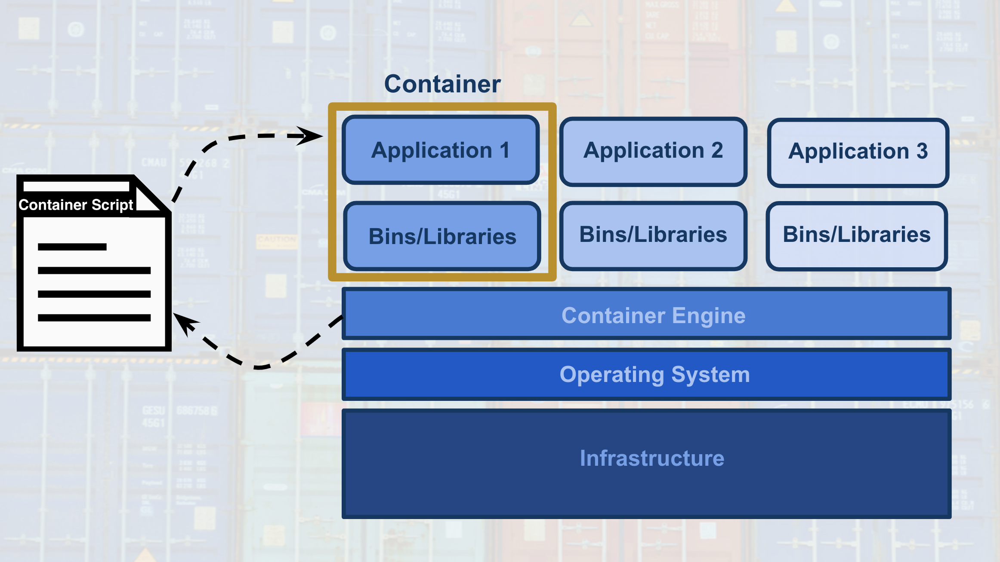

# What's ahead
In this lesson, you're going to get familiar with what's meant by _machine learning deployment_.

Specifically, we will look at answering the following questions:

1. What's the machine learning workflow?
2. How does deployment fit into the machine learning workflow?
3. What is cloud computing?
4. Why would we use cloud computing for deploying machine learning models?
5. Why isn't deployment a part of many machine learning curriculums?
6. What does it mean for a model to be deployed?
7. What are the essential characteristics associated with the code of deployed models?
8. What are different cloud computing platforms we might use to deploy our machine learning models?

# Machine Learning Workflow

Deployment is the last part of a development cycle, where we make our model available to a software or a web application.

# Cloud Computing
## What is cloud computing?
Transforming an _Information Technology (IT) product_ into a _service_.

## Why would a business decide to use cloud computing?
Most of the factors related to choosing _cloud computing services_, instead of developing _on-premise IT resources_ are related to **_time_** and **_cost_**.

### Benefits
1. Reduced Investments and Proportional Costs (providing cost reduction)
2. Increased Scalability (providing simplified capacity planning)
3. Increased Availability and Reliability (providing organizational agility)
### Risks
1. (Potential) Increase in Security Vulnerabilities
2. Reduced Operational Governance Control (over cloud resources)
3. Limited Portability Between Cloud Providers
4. Multi-regional Compliance and Legal Issues
### Other resources
- [National Institute of Standards and Technology](https://www.nist.gov/) formal definition of [Cloud Computing](https://csrc.nist.gov/publications/detail/sp/800-145/final).
- [Amazon Web Services](https://aws.amazon.com/)(AWS) discusses their definition of [Cloud Computing](https://aws.amazon.com/what-is-cloud-computing/)
- [Google Cloud Platform](https://cloud.google.com/)(GCP) discusses their definition of [Cloud Computing](https://cloud.google.com/what-is-cloud-computing/)
- [Microsoft Azure](https://azure.microsoft.com/en-us/)(Azure) discusses their definition of [Cloud Computing](https://azure.microsoft.com/en-us/overview/what-is-cloud-computing/)

## Machine Learning Applications
For **_personal use_**, one’s _likely_ to use cloud services, if they don’t have enough computing capacity.
With **_academic use_**, quite often one will use the university’s on-premise computing resources, given their availability. For smaller universities or research groups with few funding resources, _cloud services_ might offer a viable alternative to university computing resources.
For *_workplace usage_*, the amount of _cloud resources_ used depends upon an organization’s existing infrastructure and their vulnerability to the risks of cloud computing. A workplace may have security concerns, operational governance concerns, and/or compliance and legal concerns regarding _cloud usage_. Additionally, a workplace may already have on-premise infrastructure that supports the workflow; therefore, making _cloud usage_ an unnecessary expenditure. Keep in mind, many progressive companies may be incorporating _cloud computing_ into their business due to the business drivers and benefits of cloud computing.

## Paths to Deployment
### Deployment to Production
**Recall that:**
**_Deployment to production_** can simply be thought of as a method that integrates a machine learning model into an existing production environment so that the model can be used to make _decisions_ or _predictions_ based upon _data input_ into the model.
### Paths to deployment
From **_least_** to **_most_** _commonly_ used:
1. Python model is _recoded_ into the programming language of the production environment: Usually rewrite Python model to Java or C++ (for example). Rarely used because it takes time to recode, test and validate the model that provides the _same_ predictions as the _original_.
2. Model is _coded_ in _Predictive Model Markup Language_ (PMML) or _Portable Format Analytics_ (PFA): These are two complementary standards that _simplify_ moving predictive models to _deployment_ into a _production environment_. The Data Mining Group developed both PMML and PFA to provide vendor-neutral executable model specifications for certain predictive models used by data mining and machine learning. Certain analytic software allow for the direct import of PMML, such as IBM SPSS, R, SAS Base & Enterprise Miner, Apache Spark, Teradata Warehouse Miner, and TIBCO Spotfire.
3. Python model is _converted_ into a format that can be used in the production environment: _use libraries_ and _methods_ that _convert_ the model into **_code_** that can be used in the _production environment_. Most popular ML software frameworks (e.g. PyTorch, SciKit-Learn, TensorFlow) have methods that convert Python models into _intermediate standard format_, like ONNX ([Open Neural Network Exchange](https://onnx.ai/) format). This intermediate format can be converted into the software native to the production environment.
  - This is the _easiest_ and _fastest_ way **_to move_** a Python model from _modeling_ directly to _deployment_.
  - Moving forward, this is _tipically_ the way _models_ are **_moved_** into the _production environment_
  - Technologies like _containers_, _endpoints_, and _APIs_ also help **_ease_** the **_work_** required for _deploying_ a model into the _production environment_.
The **_third_** _method_ that's _most_ similar to what’s used for _deployment_ within **_Amazon’s SageMaker_**.

## Production Environments

## Rest APIs
### Model, Application, and Endpoint

One way to think of the **_endpoint_** that acts as this _interface_, is to think of a _Python program_ where:
- the **endpoint** itself is like a **_function call_**
- the **_function_** itself would be the **model** and
- the **_Python program_** is the **application**.

### Endpoint and REST API
Communication between the **application** and the **model** is done through the **endpoint** (_interface_), where the **endpoint** is an **Application Programming Interface** (**API**).
- An easy way to think of an **API**, is as a set of rules that enable programs, here the **application** and the **model**, to _communicate_ with each other.
- In this case, our **API** uses a **RE**presentational **S**tate **T**ransfer, **REST**, architecture that provides a framework for the _set of rules_ and _constraints_ that must be adhered to for _communication_ between programs.
- This **REST API** is one that uses _HTTP requests_ and _responses_ to enable communication between the **application** and the **model** through the **endpoint** (_interface_).
- Noting that _both_ the **HTTP request** and **HTTP response** are _communications_ sent between the **application** and **model**.

The **HTTP request** that is sent from your **application** to your **model** is composed of _four_ parts:
- **Endpoint**:
  - This **endpoint** will be in the form of a URL, Uniform Resource Locator, which is commonly know as a web address.
- HTTP Method:
  - There are _four_ main **HTTP methods**, but for purposes of **_deployment_** our **application** will use the **_POST method_** _only_.
    - **GET**: _READ_. This request is used to retrieve information. If the information is found, it is sent back as the response.
    - **POST**: _CREATE_. This request is used to create new information. Once a new entry is created, it tis sent back as the response.
    - **PUT**: _UPDATE_. This request is used to update information. The PATCH method also updates information, but it is only a partial update with PATCH.
    - **DELETE**: _DELETE_. This request is used to delete information.

The **HTTP response** sent from your model to your application is composed of _three_ parts:
- HTTP Status Code
  - If the model succesfully received and processed the _user's data_ that was sent in the **message**, the status code should start with a **_2_**, like _200_.
  - HTTP Headers
    - The **headers** will contain additional information, like the format of the data within the **message**, that's passed to the receiving program.
  - Message (Data or Body)
    - What's returned as the _data_ within the **message** is the _prediction_ that's provided by the **model**.

This _prediction_ is then presented to the _application user_ through the **application**. The **endpoint** is the **_interface_** that _enables communication_ between the **application** and the **model** using a **REST API**.
As we learn more about **REST****_ful_** **API**, realize that it's the **application’s** responsibility:
  - To format the _user’s data_ in a way that can be easily put into the **HTTP request** _message_ and _used_ by the **model**.
  - To translate the _predictions_ from the **HTTP response** _message_ in a way that’s easy for the _application user’s_ to understand.
Notice the following regarding the information included in the **_HTTP messages_** sent between **application** and **model**:
  - Often _user's data_ will need to be in a _CSV_ or _JSON_ format with a specific _ordering_ of the data that's dependent upon the **model** used.
  - Often _predictions_ will be returned in _CSV_ or _JSON_ format with a specific _ordering_ of the returned _predictions_ dependent upon the **model** used.

## Containers

### Model, Application, and Containers
When we discussed the production environment, it was composed of two primary programs, the **model** and the **application**, that communicate with each other through the **endpoint** (_interface_).

- The **model** is simply the _Python model_ that's created, trained, and evaluated in the **_Modeling_** component of the _machine learning workflow_.
- The **application** is simply a _web_ or _software application_ that _enables_ the application users to use the _model_ to retrieve _predictions_.

Both the **model** and the **application** require a _computing environment_ so that they can be run and available for use. One way to _create_ and _maintain_ these _computing environments_ is through the use of **_containers_**.

- Specifically, the **model** and the **application** can each be run in a **_container_** _computing environment_. The **_containers_** are created using a **_script_** that contains instructions on which software packages, libraries, and other computing attributes are needed in order to run a _software application_, in our case either the **model** or the **application**.

### Containers Defined
- A **_container_** can be thought of as a _standardized collection/bundle of software_ that is to be _used_ for the specific purpose of _running an application_.

As stated above **_container_** technology is _used to create_ the **model** and **application** _computational environments_ associated with **_deployment_** in machine learning. A common **container** software is _Docker_. Due to its popularity sometimes _Docker_ is used synonymously with **containers**.

### Containers Explained
Often to first explain the concept of **_containers_**, people tend to use the analogy of how Docker _containers_ are similar to shipping containers.

- Shipping containers can contain a wide variety of products, from food to computers to cars.
- The structure of a shipping container provides the ability for it to hold _different types_ of products while making it easy to track, load, unload, and transport products worldwide within a shipping container.

Similarly _Docker_ **_containers_**:

- Can _contain_ **_all_** types of _different_ software.
- The structure of a _Docker_ **container** enables the **container** to be _created_, _saved_, _used_, and _deleted_ through a set of _common tools_.
- The _common tool set_ works with **_any_** **container** regardless of the software the **container** contains.

### Container Structure
The image **below** shows the basic structure of a **container**, you have:

- The underlying _computational infrastructure_ which can be: a cloud provider’s data center, an on-premise data center, or even someone’s local computer.
- Next, you have an _operating system_ running on this computational infrastructure, this could be the operating system on your local computer.
- Next, there’s the _container engine_, this could be _Docker_ software running on your local computer. The _container engine_ software enables one to create, save, use, and delete containers; for our example, it could be _Docker_ running on a local computer.
- The final two layers make up the composition of the _containers_.
  - The first layer of the container is the _libraries and binaries_ required to launch, run, and maintain the _next_ layer, the _application_ layer.
- The image **below** shows _three_ containers running _three_ different applications.

This _architecture_ of **containers** provides the following _advantages_:

1. Isolates the application, which _increases_ security.

2. Requires _only_ software needed to run the application, which uses computational resources _more efficiently_ and allows for faster application deployment.

3. Makes application creation, replication, deletion, and maintenance easier and the same across all applications that are deployed using containers.

4. Provides a more simple and secure way to replicate, save, and share containers.

As indicated by the **_fourth_** _advantage_ of using **_containers_**, a **_container_** _script file_ is used to create a **_container_**.

- This _text script file_ can easily be shared with others and provides a simple method to _replicate_ a particular **_container_**.
- This **_container_** _script_ is simply the _instructions_ (_algorithm_) that is used to create a **_container_**; for _Docker_ these **_container_** _scripts_ are referred to as _dockerfiles_.

This is shown with the image **below**, where the **_container_** _engine_ uses a **_container_** _script_ to create a **_container_** for an application to run within. These **_container_** _script files_ can be stored in repositories, which provide a simple means to share and replicate **_containers_**. For _Docker_, the [Docker Hub](https://hub.docker.com/explore/) is the official repository for storing and sharing _dockerfiles_. Here's an example of a [dockerfile](https://github.com/pytorch/pytorch/blob/master/docker/pytorch/Dockerfile) that creates a docker container with Python 3.6 and PyTorch installed.

##  Characteristics of Deploying and Modeling
#### Recall that:
- **_Deployment_** to production can simply be thought of as a _method_ that _integrate_ a machine learning **model** into an _existing_ **production environment** so that the **model** can be used to make _decisions_ or _predictions_ based upon _data_ input into this **model**.
- Also remember that a **_production environmen_t** can be thought of as a _web_, _mobile_, or _other software_ **application** that is _currently_ being _used_ by _many_ people and must respond _quickly_ to those users’ requests.

Keeping these things in mind, there are a number of _characteristics_ of **deployment** and **modeling** that I’m going to introduce here. These concepts are introduced _now_ to provide you with _familiarity_ with these concepts for when you see them discussed in _future lessons_. Specifically, these concepts are provided as **_features_** that are made easier to use within cloud platforms services than if implemented with your own code.

### Characteristics of Modeling

#### Hyperparameters
In machine learning, a **hyperparameter** is a parameter whose value _cannot_ be estimated from the data.

- Specifically, a **hyperparameter** is _not directly_ learned through the estimators; therefore, their value must be _set_ by the model developer.
- This means that **hyperparameter** _tuning_ for optimization is an **_important part_** of _model training_.
- Often cloud platform machine learning services provide methods that allow for **automatic hyperparameter** _tuning_ for use with model training.

If the machine learning platform fails to offer an _automatic_ **hyperparameter** option, one option is to use methods from scikit-learn Python library for **hyperparameter** _tuning_. [Scikit-learn](https://scikit-learn.org/stable/) is a free machine learning Python library that includes _methods_ that help with [hyperparameter tuning](https://scikit-learn.org/stable/modules/grid_search.html#).

### Characteristics of Deployment
#### Model Versioning
One characteristic of deployment is the **version** of the model that is to be deployed.
- Besides saving the **model version** as a part of a _model’s metadata_ in a database, the _deployment platform_ should allow one to indicate a deployed **model’s version**.
This will make it easier to maintain, monitor, and update the deployed model.

### Model Monitoring
Another characteristic of deployment is the ability to easily **monitor** your deployed models.
- Once a model is deployed you will want to make certain it continues to meet its performance metrics; otherwise, the application may need to be updated with a _better_ performing model.

### Model Updating and Routing
The ability to easily **update** your deployed model is another characteristic of deployment.
- If a deployed model is _failing_ to meet its performance metrics, it's likely you will need to **update** this model.
If there's been a _fundamental change_ in the _data_ that’s being input into the model for predictions; you'll want to **collect** this _input data_ to be used to **update** the model.
- The _deployment platform_ should support **routing** _differing_ proportions of _user requests_ to the deployed models; to allow _comparison_ of performance between the deployed model _variants_.
**Routing** in this way allows for a test of a model _performance_ as _compared_ to other model _variants_.

### Model Predictions
Another characteristic of deployment is the _type_ of **predictions** provided by your deployed model. There are _two common_ types of **predictions**:
- **On-demand predictions**
- **Batch predictions**

### On-Demand Predictions
- **On-demand predictions** might also be called:
  - online,
  - real-time, or
  - synchronous predictions
- With these type of predictions, one expects:
  - a low latency of response to each prediction request,
  - but allows for possibility high variability in request volume.
- Predictions are returned in the response from the request. Often these requests and responses are done through an API using JSON or XML formatted strings.
- Each prediction request from the user can contain one or many requests for predictions. Noting that many is limited based upon the size of the data sent as the request. Common cloud platforms **on-demand prediction** request size limits can range from 1.5(ML Engine) to 5 Megabytes (SageMaker).
**On-demand predictions** are commonly used to provide customers, users, or employees with real-time, online responses based upon a deployed model. Thinking back on our magic eight ball web application example, users of our web application would be making **on-demand prediction** requests.

### Batch Predictions
- **Batch predictions** might also be _called_:
  - asynchronous, or
  - batch-based predictions.
- With these type of predictions, one _expects_:
  - _high volume_ of requests with more _periodic submissions_
  - so _latency_ won’t be an issue.
- Each batch request will point to specifically _formatted data file_ of requests and will return the predictions to a file. Cloud services **_require_** these files will be _stored_ in the cloud provider’s cloud.
- Cloud services typically have _limits_ to how much data they can process with each batch request based upon _limits_ they impose on the _size of file_ you can store in their cloud storage service. For example, _Amazon’s SageMaker_ limits batch predictions requests to the size limit they enforce on an object in their S3 storage service.
**Batch predictions** are _commonly_ used to help make _business decisions_. For example, imagine a business uses a complex model to predict customer satisfaction across a number of their products and they need these _estimates_ for a _weekly_ report. This would require processing customer data through a **batch prediction** request on a _weekly basis_.

# Comparing Cloud Providers
## Machine Learning Cloud Platforms
There are a number of machine learning cloud platforms, we provide _more_ details about a _few_ **below**. In the _next_ few lessons, you will learn how to use **Amazon's SageMaker** to _deploy_ machine learning models. Therefore, we _focused_ on providing _more_ information on **[Amazon's SageMaker](https://aws.amazon.com/sagemaker/)**. To allow for a comparison of features offered by [SageMaker](https://aws.amazon.com/sagemaker/), we also provide detailed information about [Google's ML Engine](https://cloud.google.com/ml-engine/) because it's _most_ similar to **SageMaker**.

## Amazon Web Services (AWS)
[Amazon Web Services (AWS) SageMake](https://aws.amazon.com/sagemaker/) is Amazon's cloud service that allows you to _build_, _train_, and _deploy_ machine learning models. Some advantages to using Amazon's SageMaker service are the following:

- **Flexibility in Machine Learning Software**: [SageMaker](https://aws.amazon.com/sagemaker/) has the flexibility to enable the use of **_any_** programming language or software framework for building, training, and deploying machine learning models in **AWS**. For the details see the three methods of modeling within **SageMaker below**.
  - **[Built-in Algorithms](https://docs.aws.amazon.com/sagemaker/latest/dg/algos.html)** - There are at least fifteen built-in algorithms that are easily used within SageMaker. Specifically, built-in algorithms for discrete classification or quantitative analysis using [linear learner](https://docs.aws.amazon.com/sagemaker/latest/dg/linear-learner.html) or [XGBoost](https://docs.aws.amazon.com/sagemaker/latest/dg/xgboost.html), item recommendations using [factorization machine](https://docs.aws.amazon.com/sagemaker/latest/dg/fact-machines.html), grouping based upon attributes using [K-Means](https://docs.aws.amazon.com/sagemaker/latest/dg/k-means.html), an algorithm for [image classification](https://docs.aws.amazon.com/sagemaker/latest/dg/image-classification.html), and many other algorithms.
  - **Custom Algorithms** - There are different programming languages and software frameworks that can be used to develop custom algorithms which include: [PyTorch](https://docs.aws.amazon.com/sagemaker/latest/dg/pytorch.html), [TensorFlow](https://docs.aws.amazon.com/sagemaker/latest/dg/tf.html), [Apache MXNet](https://docs.aws.amazon.com/sagemaker/latest/dg/apache-spark.html), [Apache Spark](https://docs.aws.amazon.com/sagemaker/latest/dg/apache-spark.html), and [Chainer](https://docs.aws.amazon.com/sagemaker/latest/dg/chainer.html).
  - **[Your Own Algorithms](https://docs.aws.amazon.com/sagemaker/latest/dg/your-algorithms.html)** - Regardless of the programming language or software framework, you can use your own algorithm when it **isn't** included within the _built-in_ or _custom algorithms_ **above**.
- **Ability to Explore and Process Data within SageMaker**: [SageMaker](https://aws.amazon.com/sagemaker/) enables the use of [Jupyter Notebooks](https://docs.aws.amazon.com/sagemaker/latest/dg/nbi.html) to explore and process data, along with creation, training, validation, testing, and deployment of machine learning models. This notebook interface makes data exploration and documentation easier.
- **Flexibility in Modeling and Deployment**: [SageMaker](https://aws.amazon.com/sagemaker/) provides a number of features and automated tools that make **_modeling_** and **_deployment_** easier. For the details on these features within SageMaker see below.
  - **[Automatic Model Tuning](https://docs.aws.amazon.com/sagemaker/latest/dg/automatic-model-tuning.html)**: [SageMaker](https://aws.amazon.com/sagemaker/) provides a feature that allows hyperparameter tuning to find the best version of the model for _built-in_ and _custom algorithms_. For built-in algorithms SageMaker also provides evaluation metrics to evaluate the performance of your models.
  - **[Monitoring Models](https://docs.aws.amazon.com/sagemaker/latest/dg/monitoring-overview.html)**: [SageMaker](https://aws.amazon.com/sagemaker/) provides features that allow you to monitor your _deployed_ models. Additionally with _model deployment_, one can choose how much traffic to route to each deployed model (model variant). More information on routing traffic to model variants can be found here and here .
  - **Type of Predictions**: SageMaker by _default_ allows for [On-demand](https://docs.aws.amazon.com/sagemaker/latest/dg/ex1-test-model.html) type of predictions where _each_ prediction _request_ can contain _one_ to _many_ requests. SageMaker also allows for [Batch](https://docs.aws.amazon.com/sagemaker/latest/dg/how-it-works-batch.html) predictions, and request _data_ size limits are based upon S3 object size limits.

## Google Cloud Platform (GCP)

[Google Cloud Platform (GCP) ML Engine](https://cloud.google.com/ml-engine/) is Google's cloud service that allows you to _build_, _train_, and _deploy_ machine learning models. Below we have highlighted some of the **_similarities_** and **_differences_** between these two cloud service platforms.

- **Prediction Costs**: The **_primary difference_** between the two is how they handle predictions. With **_SageMaker_** _predictions_, you must leave resources running to provide predictions. This enables _less_ latency in providing predictions at the _cost_ of paying for running _idle_ services, if there are no (or few) prediction requests made while services are running. With **_ML Engine_** _predictions_, one has the option to _not_ leave resources running which reduces cost associated with _infrequent_ or _periodic_ requests. Using this has _more_ latency associated with predictions because the resources are in a offline state until they receive a prediction request. The _increased_ latency is associated to bringing resources back online, but one _only_ pays for the time the resources are _in use_. To see more about [ML Engine pricing](https://cloud.google.com/ml-engine/docs/pricing#node-hour) and [SageMaker pricing](https://cloud.google.com/ml-engine/docs/pricing#node-hour).

- **Ability to Explore and Process Data**: Another **_difference_** between **ML Engine** and **SageMaker** is the fact that _Jupyter Notebooks_ are not available within **ML Engine**. To use _Jupyter Notebooks_ within **Google's Cloud Platform** (GCP), one would use [Datalab](https://cloud.google.com/datalab/docs/). **GCP** separates data exploration, processing, and transformation into other services. Specifically, [Google's Datalab](https://cloud.google.com/datalab/docs/) can be used for data exploration and data processing, [Dataprep](https://cloud.google.com/dataprep/docs/) can be used to explore and transform raw data into clean data for analysis and processing, and [DataFlow](https://cloud.google.com/dataflow/docs/) can be used to deploy batch and streaming data processing pipelines. Noting that **Amazon Web Services** (AWS), also have data processing and transformation pipeline services like [AWS Glue](https://aws.amazon.com/glue/) and [AWS Data Pipeline](https://aws.amazon.com/datapipeline/).

- **Machine Learning Software**: The final **_difference_** is that [Google's ML Engine](https://cloud.google.com/ml-engine/) has _less_ flexibility in available software frameworks for building, training, and deploying machine learning models in **GCP** as compared to **Amazon's SageMaker**. For the details regarding the two available software frameworks for modeling within **ML Engine** see **below**.

    - [Google's TensorFlow](https://cloud.google.com/ml-engine/docs/tensorflow/) is an open source machine learning framework that was originally developed by the Google Brain team. [TensorFlow](https://www.tensorflow.org/) can be used for creating, training, and deploying machine learning and deep learning models. [Keras](https://keras.io/) is a higher level API written in Python that runs on top of [TensorFlow](https://www.tensorflow.org/), that's easier to use and allows for faster development. GCP provides both [TensorFlow examples](https://cloud.google.com/ml-engine/docs/tensorflow/samples) and a [Keras example](https://cloud.google.com/ml-engine/docs/tensorflow/samples#census-keras).

    - [Google's Scikit-learn](https://cloud.google.com/ml-engine/docs/scikit/) is an open source machine learning framework in Python that was originally developed as a Google Summer of Code project. [Scikit-learn](https://cloud.google.com/ml-engine/docs/scikit/) and an [XGBoost Python package](https://xgboost.readthedocs.io/en/latest/python/index.html) can be used together for creating, training, and deploying machine learning models. In the in [Google's example](https://cloud.google.com/ml-engine/docs/scikit/training-xgboost), [XGBoost](https://xgboost.readthedocs.io/en/latest/python/index.html) is used for modeling and [Scikit-learn](https://cloud.google.com/ml-engine/docs/scikit/) is used for processing the data.

- **Flexibility in Modeling and Deployment**: [Google's ML Engine](https://cloud.google.com/ml-engine/) provides a number of features and automated tools that make **_modeling_** and **_deployment_** easier, **_similar_** to the those provided by **Amazon's SageMaker**. For the details on these features within **ML Engine** see **below**.
    - [Automatic Model Tuning](https://cloud.google.com/ml-engine/docs/tensorflow/hyperparameter-tuning-overview): [Google's ML Engine](https://cloud.google.com/ml-engine/) provides a feature that enables hyperparameter tuning to find the **best** version of the model.
    - [Monitoring Models](https://cloud.google.com/ml-engine/docs/tensorflow/monitor-training): [Google's ML Engine](https://cloud.google.com/ml-engine/) provides features that allow you to monitor your models. Additionally [ML Engine](https://cloud.google.com/ml-engine/) provides methods that enable [managing runtime versions](https://cloud.google.com/ml-engine/docs/tensorflow/versioning) and [managing models and jobs](https://cloud.google.com/ml-engine/docs/tensorflow/managing-models-jobs).
    - **Type of Predictions**: [ML Engine](https://cloud.google.com/ml-engine/) allows for [Online](https://cloud.google.com/ml-engine/docs/tensorflow/online-predict)(_or On-demand_) type of predictions where _each_ prediction _request_ can contain _one_ to _many_ requests. **ML Engine** also allows for [Batch](https://cloud.google.com/ml-engine/docs/tensorflow/batch-predict) predictions. More information about **ML Engine's** [Online and Batch predictions](https://cloud.google.com/ml-engine/docs/tensorflow/online-vs-batch-prediction).

## Microsoft Azure
Similar to [Amazon's SageMaker](https://aws.amazon.com/sagemaker/) and [Google's ML Engine](https://cloud.google.com/ml-engine/), Microsoft offers [Azure AI](https://azure.microsoft.com/en-us/overview/ai-platform/#platform). **Azure AI** offers an open and comprehensive platform that includes AI software frameworks like: [TensorFlow](https://www.tensorflow.org/), [PyTorch](https://pytorch.org/), [scikit-learn](http://scikit-learn.org/stable/), [MxNet](https://mxnet.incubator.apache.org/), [Chainer](https://chainer.org/), [Caffe2](https://caffe2.ai/), and other software like their [Azure Machine Learning Studio](https://azure.microsoft.com/en-us/services/machine-learning-studio/). For more details see [Azure AI](https://azure.microsoft.com/en-us/overview/ai-platform/#platform) and [Azure Machine Learning Studio](https://azure.microsoft.com/en-us/services/machine-learning-studio/).

## Paperspace
[Paperspace](https://www.paperspace.com/ml) simply provides GPU-backed virtual machines with industry standard software tools and frameworks like: [TensorFlow](https://www.tensorflow.org/), [Keras](https://keras.io/), [Caffe](http://caffe.berkeleyvision.org/), and [Torch](http://torch.ch/) for machine learning, deep learning, and data science. **Paperspace** claims to provide more powerful and less expensive virtual machines than are offered by **AWS**, **GCP**, or **Azure**.

## Cloud Foundry
[Cloud Foundry](https://www.cloudfoundry.org/) is an open source cloud application platform that's backed by companies like: Cisco, Google, IBM, Microsoft, SAP, and more. [Cloud Foundry](https://www.cloudfoundry.org/) provides a faster and easier way to build, test, deploy, and scale applications by providing a choice of clouds, developer frameworks, and applications services to it's users. [Cloud Foundry Certified Platforms](https://www.cloudfoundry.org/certified-platforms/) provide a way for an organization to have their cloud applications portable across platforms including [IBM](https://www.ibm.com/cloud/cloud-foundry) and [SAP](https://cloudplatform.sap.com/index.html) cloud platforms.
