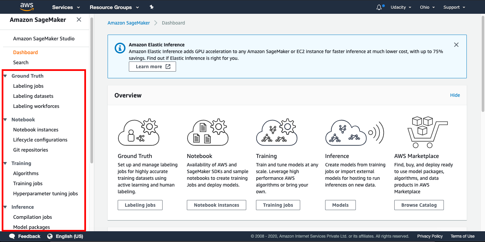

# Introduction to AWS SageMaker
Highly speaking, SageMaker is the combination of _two_ features: managed **Jupyter Notebooks** and the **SageMaker's API**.
One can use the managed Notebooks during the _exploratory_ phase of the ML workflow, while using SageMaker to help during the _modeling_ and _deployment_ stages.
During the _training_ stage, a _computational task_ is constructed (e.g: to fit a model to a data set). Then, this task is run on a _virtual machine_. The resulting model is then saved to a file, and this is called a _model artifact_.


The _inference_ process is fairly similar to the _training_ process. Here, a _computational task_ is created to perform the inference. This task is run on a _virtual machine_. However, in this case, our virtual machine _keeps waiting_ until it gets an _input_ and the _model artifacts_ to deliver some results.


# A. What is AWS Sagemaker?

AWS (or Amazon) SageMaker is a _fully managed_ service that provides the ability to build, train, tune, deploy, and manage large-scale machine learning (ML) models quickly. Sagemaker provides tools to make each of the following steps simpler:

1. Explore and process data
    - Retrieve
    - Clean and explore
    - Prepare and transform
2. Modeling
    - Develop and train the model
    - Validate and evaluate the model
3. Deployment
    - Deploy to production
    - Monitor, and update model & data

**The Amazon Sagemaker provides the following tools:**

- Ground Truth - To label the jobs, datasets, and workforces
- Notebook - To create Jupyter notebook instances, configure the lifecycle of the notebooks, and attache Git repositories
- Training - To choose an ML algorithm, define the training jobs, and tune the hyperparameter
- Inference - To compile and configure the trained models, and endpoints for deployments

The snapshot of the _Sagemaker Dashboard_ below shows the tools mentioned above.



> ###### IMPORTANT NOTICE: This is the current AWS UI as of April 6th, 2020. The AWS UI is subject to change on a regular basis. We advise students to refer to AWS documentation for the above process.

## A.1. Why is SageMaker a "fully managed" service?

SageMaker helps to reduce the complexity of building, training and deploying your ML models by offering all these steps on a single platform. SageMaker supports building the ML models with _modularity_, which means you can reuse a model that you have already built earlier in other projects.

## A.2. SageMaker Instances - Important to Read

SageMaker instances are the dedicated VMs that are optimized to fit different machine learning (ML) use cases. The supported instance types, names, and pricing in SageMaker are different than that of EC2. Refer the following links to have better insight:

- [Amazon SageMaker ML Instance Types](https://aws.amazon.com/sagemaker/pricing/instance-types/) - **_See that an instance type is characterized by a combination of CPU, memory, GPU, GPU memory, and networking capacity._**
- [Amazon EC2 Instance Types](https://aws.amazon.com/ec2/instance-types/) - To have you know the difference in naming and combinations of CPU, memory, storage, and networking capacity.

## A.3. Supported Instance Types and Availability Zones

Amazon SageMaker offers a variety of instance types. Interestingly, **_the type of SageMaker instances that are supported varies with AWS Regions and Availability Zones_**.

- First, you need to check the [List of the AWS Regions that support Amazon SageMaker](https://docs.aws.amazon.com/general/latest/gr/rande.html#sagemaker_region).
- Next, you can check the various available [Amazon SageMaker ML Instance Types](https://aws.amazon.com/sagemaker/pricing/instance-types/), again.

## A.4. Instances Required for Deep Learning

The table below describes the three types of SageMaker instances that you would use in this course:

SageMaker | Instance | vCPU | GPU Mem (GiB) | GPU Mem (GiB) | Network Performance | Usage | Default Quota (Limit)
--- | --- | --- | --- | --- | --- | --- | ---
`ml.t2.medium` | 2 | - | 4 | - | Low to Moderate | Run notebooks | 0 - 20
`ml.m4.xlarge` | 4 | - | 16 | - | High | Train and batch transform XGBOOST models; Deploy all models preceding the first project | 0 - 20
`ml.p2.xlarge` | 4 | 1xK80 | 61 | 12 | High | Train and batch transform GPU accelerated Pytorch models for the first project | 0 - 1

In this course, the `ml.m4.xlarge` is needed at an early stage, while `ml.p2.xlarge` is needed only when working on the for the first project: Deploying a Sentiment Analysis Model.

> ### Note
>
> Sagemaker quotas, also referred to as limits, are very tricky. Every AWS user does not get the default quotas for SageMaker instances, which is why the last column shows a range, e.g., 0 - 20. The **Default Quota** depends on the instance type, the task you want to run (see table above), and also the region in which the Sagemaker service is requested. Refer [this document](https://docs.aws.amazon.com/general/latest/gr/sagemaker.html) having a caveat that new accounts may not always get the default limits.

# B. Shut Down SageMaker Instances, if not in use

> #### Note: We recommend you shut down every resource (e.g., SageMaker instances, or any other hosted service) on the AWS cloud immediately after the usage; otherwise, you will be billed even if the resources are not in actual use.

Even if you are in the middle of the project and need to step away, **PLEASE SHUT DOWN YOUR SAGEMAKER INSTANCE**. You can re-instantiate later.

## Recommended Read

[AWS Sagemaker FAQs](https://aws.amazon.com/sagemaker/faqs/)


# Setting up a Notebook Instance

The first thing we are going to need to do is set up a notebook instance!

This will be the primary way in which we interact with the SageMaker ecosystem. Of course, this is not the _only_ way to interact with SageMaker's functionality, but it is the way that we will use in this module.

The video below guides you through setting up your first notebook instance. Also, if you prefer to read the instructions instead, these have been provided underneath the video.

**Note:** Once a notebook instance has been set up, by default, it will be **InService** which means that the notebook instance is running. This is important to know because the _cost_ of a notebook instance is based on the length of time that it has been running. This means that once you are finished using a notebook instance you should **Stop** it so that you are no longer incurring a cost. Don't worry though, you won't lose any data provided you don't delete the instance. Just start the instance back up when you have time and all of your saved data will still be there.

## Searching for SageMaker

Your main console page may look slightly different than in the above example. You should still be able to find **Amazon SageMaker** by either:

1. Clicking on _All Services_ then scrolling down and navigating to Machine Learning> Amazon SageMaker, or
2. By searching for SageMaker, as in the below screenshot (and clicking on it).


## Creating and Running a Notebook Instance

First, start by logging in to the [AWS console](https://console.aws.amazon.com/), opening the SageMaker dashboard, selecting **Notebook Instances** and clicking on **Create notebook instance**.

You may choose any name you would like for your notebook. Also, using **ml.t2.medium** should be all that is necessary for the notebooks that you will encounter in this module. In addition, an **ml.t2.medium** instance is covered under the free tier.

Next, under **IAM role** select **Create a new role**. You should get a pop-up window that looks like the one below. The only change that needs to be made is to select **None** under **S3 buckets you specify**, as is shown in the image below.


Once you have finished setting up the role for your notebook, your notebook instance settings should look something like the image below.


**Note:** Your notebook name may be different than the one displayed and the IAM role that appears will be different.

Now scroll down and click on **Create notebook instance**.

Once your notebook instance has started and is accessible, click on **open** to get to the Jupyter notebook main page.


# Getting the Notebooks

Recently, SageMaker has added a line in the setup code to link directly to a Github repository and it's recommended that you use that setup!

Also on the `Actions` list, you should select `Open Jupyter` to get to the examples notebooks. from the dropdown menu, you'll still be able to see the `Stop` action.

* * *

Now that your notebook instance has been set up and is running, it's time to get the notebooks that we will be using during this module.

These notebooks are stored in a [repository on Github](https://github.com/udacity/sagemaker-deployment) and the easiest way to make them available inside of your notebook instance is to use **git** and clone the repository.

The video below goes through this process. Also, if you would prefer to read the instructions, these have been provided and can be found underneath the video.

# Cloning the Deployment Notebooks

In order to clone the deployment repository into your notebook instance, click on the **new** drop down menu and select **terminal**. By default, the working directory of the terminal instance is the home directory, however, the Jupyter notebook hub's root directory is under `SageMaker`. Enter the appropriate directory and clone the repository as follows:

```
cd SageMaker
git clone https://github.com/udacity/sagemaker-deployment.git
exit
```

After you have finished, close the terminal window.

Your notebook instance is now set up and ready to be used!

# Boston Housing Example

### SageMaker Sessions & Execution Roles

SageMaker has some unique objects and terminology that will become more familiar over time. There are a few objects that you'll see come up, over and over again:

- **Session** - A session is a special _object_ that allows you to do things like manage data in S3 and create and train any machine learning models; you can read more about the functions that can be called on a session, [at this documentation](https://sagemaker.readthedocs.io/en/latest/session.html). The `upload_data` function should be close to the top of the list! You'll also see functions like `train`, `tune`, and `create_model` all of which we'll go over in more detail, later.
- **Role** - Sometimes called the _execution role_, this is the IAM role that you created when you created your notebook instance. The role basically defines how data that your notebook uses/creates will be stored. You can even try printing out the role with `print(role)` to see the details of this creation.

### Uploading to an S3 Bucket

Another SageMaker detail that is new is the method of data storage. In these instances, we'll be using S3 buckets for data storage.

> S3 is a virtual storage solution that is mostly meant for data to be written to few times and read from many times. This is, in some sense, the main workhorse for data storage and transfer when using Amazon services. These are similar to file folders that contain data _and_ metadata about that data, such as the data size, date of upload, author, and so on.

**S3** stands for Simple Storage Service (S3).

After you upload data to a session, you should see that an S3 bucket is created, as indicated by an output like the following:

```
INFO: sagemaker: Created S3 bucket: <message specific to your locale, ex. sagemaker-us-west-1-#>
```

If you'd like to learn more about how we're creating a csv file, you can check out [the pandas documentation](https://pandas.pydata.org/pandas-docs/stable/generated/pandas.concat.html). Above, we are just concatenating x and y data sets as columns of data (`axis=1`) and converting that pandas dataframe into a csv file using `.to_csv`.

## Boston Housing Data

For our very first time using SageMaker we will be looking at the problem of estimating the median cost of a house in the Boston area using the [Boston Housing Dataset](https://www.cs.toronto.edu/~delve/data/boston/bostonDetail.html).

We will be using this dataset often throughout this module as it provides a great example on which to try out all of SageMaker's features.

In addition, we will be using a random tree model. In particular, we will be using the [XGBoost](https://xgboost.readthedocs.io/en/latest/) algorithm. The details of XGBoost are beyond the scope of this module as we are interested in learning about SageMaker. If you would like to learn more about XGBoost I would recommend starting with the documentation which you can find at [https://xgboost.readthedocs.io/en/latest/](https://xgboost.readthedocs.io/en/latest/)

The notebook we will be working though in this video and in the following two videos can be found in the `Tutorial` directory and is called `Boston Housing - XGBoost (Batch Transform) - High Level.ipynb`. Now that you know why **Boston Housing** and **XGBoost** are in the name, let's talk a bit about the rest of it.

First, **Batch Transform** is the method we will be using to test our model once we have trained it. This is something that we will discuss a little more later on.

Second, **High Level** describes the API we will be using to get SageMaker to perform various machine learning tasks. In particular, it refers to the Python SDK whose documentation can be found here: [https://sagemaker.readthedocs.io/en/latest/](https://sagemaker.readthedocs.io/en/latest/). This high level approach simplifies a lot of the details when working with SageMaker and can be very useful.

# Boston Housing Example - Training the Model
### XGBoost in Competition

There's a [list of winning XGBoost-based solutions](https://github.com/dmlc/xgboost/tree/master/demo#machine-learning-challenge-winning-solutions) to a variety of competitions, at the linked XGBoost repository.

### Estimators

You can read [the documentation on estimators](https://sagemaker.readthedocs.io/en/latest/estimators.html) for more information about this object. Essentially, the Estimator is an object that specifies some details about how a model will be trained. It gives you the ability to create and deploy a model.

### Training Jobs

A training job is used to train a specific estimator.

When you request a training job to be executed you need to provide a few items:

1. A location on S3 where your training (and possibly validation) data is stored,
2. A location on S3 where the resulting model will be stored (this data is called the model artifacts),
3. A location of a docker container (certainly this is the case if using a built in algorithm) to be used for training
4. A description of the compute instance that should be used.

Once you provide all of this information, SageMaker will executed the necessary instance (CPU or GPU), load up the necessary docker container and execute it, passing in the location of the training data. Then when the container has finished training the model, the _model artifacts_ are packaged up and stored on S3.

You can see a high-level (which we've just walked through) example of training a KMeans estimator, [in this documentation](https://docs.aws.amazon.com/sagemaker/latest/dg/ex1-train-model-create-training-job.html). This high-level example defines a KMeans estimator, and uses `.fit()` to train that model. Later, we'll show you a low-level model, in which you have to specify many more details about the training job.

#### Material de apoio

[XGBoost paper](https://video.udacity-data.com/topher/2018/November/5bfdf09f_xgboost/xgboost.pdf)

# Mini-Project: Building Your First Model

Now that you've seen an example of how to use SageMaker, it's _your_ turn to try it out!

If you look at the deployment [Gitub repository](https://github.com/udacity/sagemaker-deployment), inside of the `Mini-Projects` folder is a notebook called `IMDB Sentiment Analysis - XGBoost (Batch Transform).ipynb`. Inside of the notebook are some tasks for you to complete.

As you progress through the notebook you will construct an XGBoost model that tries to determine the sentiment, positive or negative, of a movie review using the [IMDB Dataset](http://ai.stanford.edu/~amaas/data/sentiment/). Moving forward, most of the mini-projects that you will complete throughout this module will use the IMDB dataset.

**Note:** For the most part, creating this XGBoost model is pretty similar to the Boston Housing example that we just looked at so you can look there if you get stuck. In addition, a solution has been provided and in the next video we will go over my solution to this notebook.

# Boston Housing In-Depth

Now that we've had a chance to look at how SageMaker is used, let's take a deeper look at what is going on behind the scenes.

In the previous notebooks we looked at, we use the Python SDK to interact with SageMaker, calling this the high-level approach. Now we will look at the low level approach where we describe different tasks we want SageMaker to perform. The documentation for the low level approach can be found in the [Amazon SageMaker Developer Guide](https://docs.aws.amazon.com/sagemaker/latest/dg/whatis.html)

The notebook that we will be looking at in this video and in the remainder of this lesson is contained in the `Tutorial` folder and is the `Boston Housing - XGBoost (Batch Transform) - Low Level.ipynb` notebook.

You will notice as we go through the details that describing the different tasks we want SageMaker to do can be quite involved. However there is a reason to understand it!

The high level approach makes developing new models very straightforward, requiring very little code. The reason this can be done is that certain decisions have been made for you. The low level approach allows you to be far more particular in how you want the various tasks executed, which is good for when you want to do something a little more complicated.

# What have we learned so far?

In this lesson we went over the basics of how models can be constructed and trained using Amazon SageMaker. In addition, we saw some of how SageMaker works and how it interacts with other services.

In particular, we learned how Amazon S3 is used as a central storage service when using SageMaker. In order to train a model, data must first be available on S3, and once the model has been trained, the model artifacts are also stored on S3.

We also saw how to use SageMaker to train models and fit them to data, saving the results (called model artifacts).

Lastly, we looked at how we could use SageMaker's Batch Transform functionality to test our models.

## What are the main components of a SageMaker model?
In SageMaker, a model is a collection of information that describes how to perform inference. For the most part, this comprises two very important pieces.

The first is the container that holds the model inference functionality. For different types of models this code may be different but for simpler models and models provided by Amazon this is typically the same container that was used to train the model.

The second is the model artifacts. These are the pieces of data that were created during the training process. For example, if we were fitting a linear model then the coefficients that were fit would be saved as model artifacts.

## What happens when a model is fit using SageMaker?
When a model is fit using SageMaker, the process is as follows.

First, a compute instance (basically a server somewhere) is started up with the properties that we specified.

Next, when the compute instance is ready, the code, in the form of a container, that is used to fit the model is loaded and executed. When this code is executed, it is provided access to the training (and possibly validation) data stored on S3.

Once the compute instance has finished fitting the model, the resulting model artifacts are stored on S3 and the compute instance is shut down.

# What's next?

In the next few lessons we are going to look at some of the more advanced functionality of SageMaker.

To begin with, we will look at deploying a model using SageMaker. This means making a model available for other entities to use. Along the way we will create a simple web app that interacts with a deployed model.

In addition, we will look at hyperparameter tuning. Which is a way to train a bunch of different models, all with different hyperparameters, and then select the one that performs the best.

Lastly, we will take a look at updating a deployed model. Sometimes a model may not work as well as it once did due to changes in the underlying data. In [this resource](https://edouardfouche.com/Data-Stream-Generation-with-Concept-Drift/), you can read more about how a model's predictions and accuracy may degrade as a result of something called _concept drift_, which is a change in the underlying data distribution over time. When this happens we might want to update a deployed model, however, our model may be in use so we don't want to shut it down. SageMaker allows us to solve this problem without there being any loss of service.
