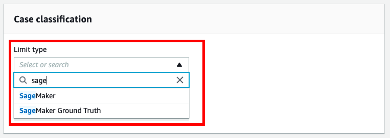
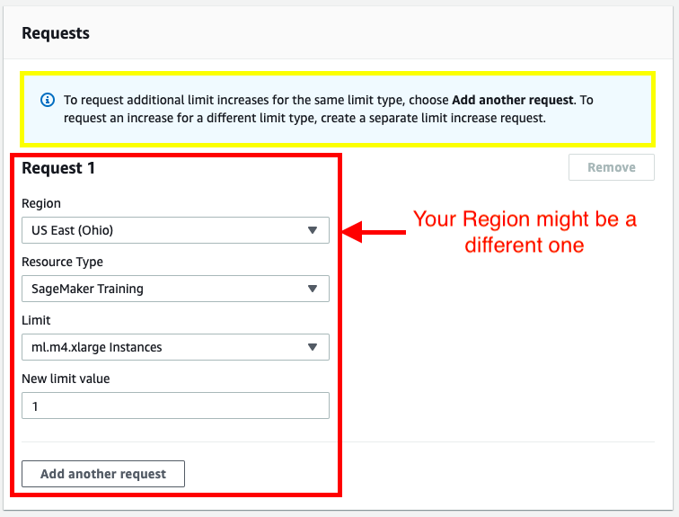

# Deployment Project
[Video](https://youtu.be/LWcJtUKVkzo)

# Setting up a Notebook Instance

The deployment project which you will be working on is intended to be done using Amazon's SageMaker platform. In particular, it is assumed that you have a working notebook instance in which you can clone the deployment repository.

If you have not yet done this, please see the beginning of Lesson 2 in which we walk through creating a notebook instance and cloning the deployment repository. Alternatively, you can follow the instructions below.

First, start by logging in to the [AWS console](http://console.aws.amazon.com/), opening the SageMaker dashboard and clicking on **Create notebook instance**.

You may choose any name you would like for your notebook. A **ml.t2.medium** is used to launch the notebook and is available by default. Inside the notebook **ml.p2.xlarge** is used for **training** a model and **ml.m4.xlarge** is used for **deployment**. These instance may not be available to all users by default. If you haven't requested **ml.p2.xlarge** so far please follow the instructions on the next page to request it now.

Next, under **IAM role** select **Create a new role**. You should get a pop-up window that looks like the one below. The only change that needs to be made is to select **None** under **S3 buckets you specify**, as is shown in the image below.

Once you have finished setting up the role for your notebook, your notebook instance settings should look something like the image below.

Note that your notebook name may be different than the one displayed and the IAM role that appears will be different.

Next, scroll down to the section labelled **Git repositories**. Here you will clone the `https://github.com/udacity/sagemaker-deployment.git` repository.

Once you have filled in all of the required values, the settings should look as so:

You're done! Click on **Create notebook instance**.

Your notebook instance is now set up and ready to be used!

Once the Notebook instance has loaded, you will see a screen resembling the following.

You can access your notebook using the Action "Open Jupyter".

## A. AWS Service Utilization Quota (Limits)

You need to understand the way AWS imposes **_utilization quotas_** (limits) on almost all of its services. _Quotas_, also referred to as _limits_, are the maximum number of resources of a particular service that you can create in your AWS account.

- AWS provides default quotas, **for each AWS service.**
- Importantly, **each quota is region-specific.**
- There are three ways to **view your quotas**, as mentioned [here](https://docs.aws.amazon.com/general/latest/gr/aws_service_limits.html):
    1. Service Endpoints and Quotas,
    2. Service Quotas console, and
    3. AWS CLI commands - `list-service-quotas` and `list-aws-default-service-quotas`
- In general, there are three ways to **increase the quotas**:
    1. Using [_Amazon Service Quotas_](https://aws.amazon.com/about-aws/whats-new/2019/06/introducing-service-quotas-view-and-manage-quotas-for-aws-services-from-one-location/) service - This service consolidates your account-specific values for quotas across all AWS services for improved manageability. Service Quotas is available at no additional charge. You can directly try logging into [Service Quotas console](https://console.aws.amazon.com/servicequotas/home) here.
    2. Using [_AWS Support Center_](https://console.aws.amazon.com/support/home) - You can create a case for support from AWS.
    3. AWS CLI commands - `request-service-quota-increase`

### A.1. Amazon SageMaker Utilization Quota (Limits)

You can view the _Amazon SageMaker Service Limits_ at ["Amazon SageMaker Endpoints and Quotas"](https://docs.aws.amazon.com/general/latest/gr/sagemaker.html) page. You can request to increase the AWS Sagemaker quota using the [_AWS Support Center_](https://console.aws.amazon.com/support/home) only. Note that currently the _Amazon Service Quotas_ does not support SageMaker service. However, SageMaker would be introduced soon into Service Quotas. AWS is moving to make users manage quotas for all AWS services from one central location.

SageMaker would be introduced soon into Services Quota - Courtesy - [_Amazon Service Quotas_](https://aws.amazon.com/about-aws/whats-new/2019/06/introducing-service-quotas-view-and-manage-quotas-for-aws-services-from-one-location/)

### A.2. Increase Sagemaker Instance Quota (Limit) using AWS Support Center

Read the note and recommendation below before proceeding further.

> #### Note
>
> Suppose a student has a quota of 20 instances of `ml.m4.xlarge` by default, they would not notice it unless they run the notebook that uses that instance. Now, if they go to the AWS Support Center, to request a service limit increase by 1, their instance limit will be degraded from 20 to 1.

#### Recommendation

1. For `ml.m4.xlarge`\- The default quota would be any number in the range \[0 - 20\]. Students can expect an error - _'ResourceLimitExceeded'_, when executing the notebook in the concept **_Boston Housing Problem - Training The Model_**, later in this lesson. In such a case only, the student must request a limit increase for `ml.m4.xlarge`.
2. For `ml.p2.xlarge` - The default quota would be either 0 or 1, therefore it is alright to go ahead and request an increase anytime.

1. Sign in to AWS console - _[https://aws.amazon.com/console/](https://aws.amazon.com/console/)_

Sign in to AWS console

2. Go to the [AWS Support Center](https://console.aws.amazon.com/support/home#/) and create a _case_.

AWS Support Center

3. Click on _Service limit increase_

Create a case for support

4. It will expand three sections - _Case classification_, _Case description_, and _Contact options_ on the same page. In _Case classification_ section, select **"Sagemaker"** as the _Limit type_.

Case classification section that takes the Limit type

5. It will expand one more section - _Requests_ on the same page. In _Request_ section, and select the Region in which you are using the SageMaker service.
    - Select Sagemaker Training as the Resource Type
    - Select the instance type (ml.m4.xlarge or ml.p2.xlarge) under the Limit field
    - Under new limit value, select 1

Request section that takes Region, Resource type, and LImit values

6. Provide a case description and the contact options before submitting the case to support.

> ###### IMPORTANT NOTICE: This is the current AWS UI as of April 6th, 2020. The AWS UI is subject to change on a regular basis. We advise students to refer to AWS documentation for the above process.

## Envio de projeto

Have project questions? Ask a technical mentor or search for existing answers!

Ask a mentor

 ######  data de vencimento

19/12/2020

 ######  status

Not submitted

Due at: Sáb, Dez 19 4:02 pm

## Project Overview

Welcome to the SageMaker deployment project! In this project you will construct a recurrent neural network for the purpose of determining the sentiment of a movie review using the IMDB data set. You will create this model using Amazon's SageMaker service. In addition, you will deploy your model and construct a simple web app which will interact with the deployed model.

## Project Instructions

The deployment project which you will be working on is intended to be done using Amazon's SageMaker platform. In particular, it is assumed that you have a working notebook instance in which you can clone the deployment repository.

## Evaluation

Your project will be reviewed by a Udacity reviewer against the deployment project [rubric](https://review.udacity.com/#!/rubrics/2539/view). Review this rubric thoroughly, and self-evaluate your project before submission. All criteria found in the rubric must meet specifications for you to pass.

## Project Submission

When you are ready to submit your project, collect all of the files in the project directory and compress them into a single archive for upload. In particular, make sure that the following files are included:

- The `SageMaker Project.ipynb` file with fully functional code, **all code cells executed and displaying output**, and **all questions answered**.
- An HTML or PDF export of the project notebook with the name `report.html` or `report.pdf`.
- The completed `train/train.py` and `serve/predict.py` python files.
- The edited `website/index.html` file.

Alternatively, your submission could consist of the GitHub link to your repository.

## Project Submission Checklist

**Before submitting your project, please review and confirm the following items.**

 I am confident all rubric items have been met and my project will pass as submitted.

 Project builds correctly without errors and runs.

 All required functionality exists and my project behaves as expected per the project's specifications.

**Once you have checked all these items, you are ready to submit!**

### Ready to submit your project?

Click on the "Submit Project" button and follow the instructions to submit!
