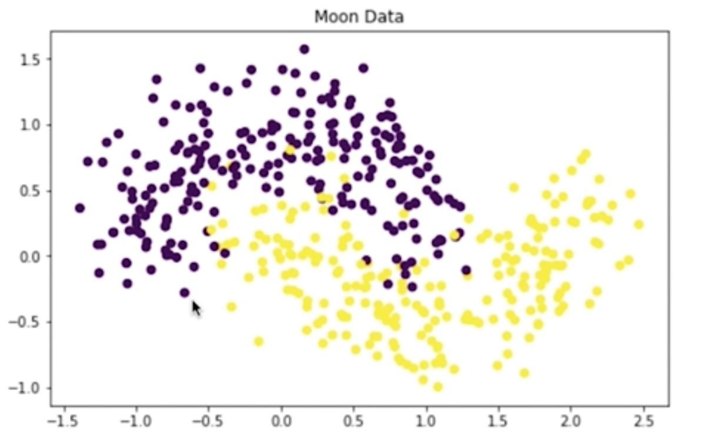
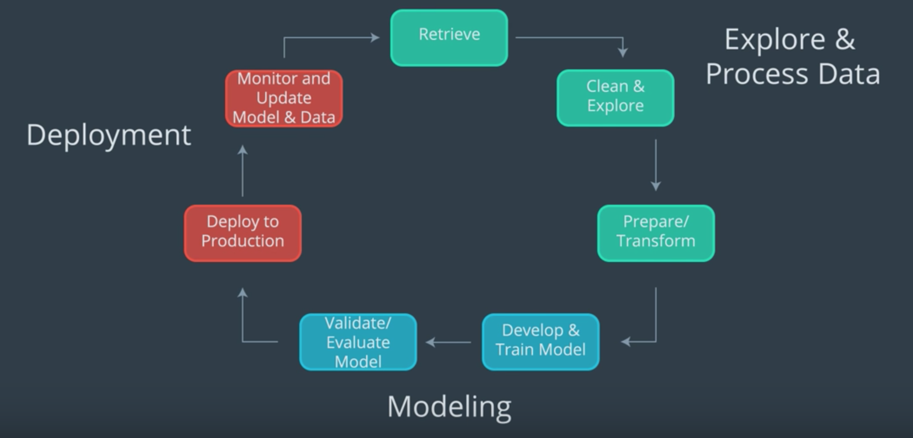

# Notebook: Custom Models & Moon Data, Exercise

Next, you'll approach the task of building and training a custom PyTorch classifier to classify data! Specifically, you'll be tasked with classifying "moon data," which is 2-dimensional data whose classes are distributed to look a bit like moons in 2D space.



Slightly noisy, purple (top) and yellow (bottom) "moon" data.

Building and training a custom model is presented as an alternative to something like a LinearLearner, which is great in many cases but may fail for data that is not easily separable. As you follow along with this lesson, you should work in the referenced SageMaker notebooks. We will present a solution to you, but please try to work on a solution of your own, when prompted. Much of the value in this experience will come from experimenting with the code, **in your own way**.

To open this notebook:

> - Navigate to your SageMaker notebook instance, in the [SageMaker console](https://console.aws.amazon.com/sagemaker/), which has been linked to the main [Github exercise repository](https://github.com/udacity/ML_SageMaker_Studies)
> - Activate the notebook instance (if it is in a "Stopped" state), and open it via Jupyter
> - Click on the exercise notebook in the `Moon_Data` directory.

You may also directly view the exercise and solution notebooks via the repository at the following links:

- [Exercise notebook](https://github.com/udacity/ML_SageMaker_Studies/blob/master/Moon_Data/Moon_Classification_Exercise.ipynb)
- [Solution notebook](https://github.com/udacity/ML_SageMaker_Studies/blob/master/Moon_Data/Moon_Classification_Solution.ipynb)

In this particular case, you will also find a directory `source` and `source_solution` for further reference.

**The solutions are meant to be consulted if you are stuck or want to check your work.**

## Notebook Outline

We'll go over the following steps to complete the notebook.

- Upload data to S3
- Define a PyTorch neural network for binary classification
- Write a custom **training script**
- Train and evaluate the custom model

## Later: Delete Resources

At the end of this exercise, and intermittently, you will be reminded to delete your endpoints and resources so that you do not incur any extra processing or storage fees!

# Moon Data & Custom Models
[Video](https://youtu.be/vb5ojq8Jw7k)

# Upload Data to S3
[Video](https://youtu.be/Mz08Bac6h2Y)

# Exercise: Custom PyTorch Classifier
[Video](https://youtu.be/kiZ22MJWSFU)

# Solution: Simple Neural Network
[Video](https://youtu.be/FINTJpz1Yx0)

# Exercise: Training Script
[Video](https://youtu.be/1cbvRmKvQIg)

# Solution: Complete Training Script
[Video](https://youtu.be/xmrB3sqbeTU)

# Custom SKLearn Model
## Defining a Custom Model

To define a custom model, you need to have the **model** itself and the following two scripts:

- A **training** script that defines how the model will accept input data, and train. This script should also save the trained model parameters.
- A **predict** script that defines how a trained model produces an output and in what format.

## PyTorch

In PyTorch, you have the option of defining a neural network of your own design. These models do not come with any built-in predict scripts and so you have to write one yourself.

## SKLearn

The `scikit-learn` library, on the other hand, has many pre-defined models that come with train and predict functions attached!

You can define custom SKLearn models in a very similar way that you do PyTorch models only you typically **only** have to define the training script. You can use the default predict function.

# PyTorch Estimator
[Video](https://youtu.be/pJOkQfMtxpc)

# Exercise: Create a PyTorch Model
## Create and Deploy a Trained Model

Before you can deploy a custom PyTorch model, you have to take one more step: creating a `PyTorchModel`. In earlier exercises, you could see that a call to `.deploy()` created **both** a _model_ and an _endpoint_, but for PyTorch models, these steps have to be separate. PyTorch models do not automatically come with `.predict()` functions attached (as many Amazon and Scikit-learn models do, for example) and you may have noticed that you've been given a `predict.py` file in the `source` directory. This file is responsible for loading a trained model and applying it to passed in, numpy data.

Now, when we created a PyTorch **estimator**, we specified where the training script, `train.py` was located. And we'll have to do something very similar here, but for a PyTorch **model** and the `predict.py` file.

### EXERCISE: Instantiate a PyTorchModel

You can create a `PyTorchModel` from your trained, estimator attributes. This model is responsible for knowing how to execute a specific `predict.py` script. And this model is what you'll deploy to create an endpoint.

#### Model Parameters

To instantiate a `PyTorchModel`, ([documentation, here](https://sagemaker.readthedocs.io/en/stable/sagemaker.pytorch.html#pytorch-model)) you pass in the same arguments as your PyTorch estimator, with a few additions/modifications:

- **model\_data**: The trained model.tar.gz file created by your estimator, which can be accessed as estimator.model\_data.
- **entry\_point**: This time, this is the path to the Python script SageMaker runs for prediction rather than training, predict.py.

In the exercise notebook, you've been given the following code to fill in:

```
%%time
# importing PyTorchModel
from sagemaker.pytorch import PyTorchModel

# Create a model from the trained estimator data
# And point to the prediction script
model = None
```

### EXERCISE: Deploy the trained model

Deploy your model to create a predictor. We'll use this to make predictions on our test data and evaluate the model.

```
%%time
# deploy and create a predictor
predictor = None
```

### Evaluate your Model

After deploying your model, you have been given some code to evaluate its performance according to a variety of metrics!

> Remember to **delete your predictor endpoint** _after_ you've finished evaluating the model.

Try to complete these steps on your own, and I'll go over one solution, next!

# Solution: PyTorch Model and Evaluation
[Video](https://youtu.be/qZTyQqo9FWM)

# Summary of Skills

You've really learned a lot at this point in the course! You should be familiar with each part of the machine learning workflow from data loading and processing to model training and deployment.



Machine learning workflow.

By studying specific case studies, you should have a better idea of what kinds of machine learning models may be applied to different scenarios.

- Essentially, you want to choose an **unsupervised** or **supervised** model based on the given data
- Often you'll want to process and transform your given data to extract the most relevant and comparable **features** for a given task
- Then you'll want to refine your choice of model and tune it based on constraints given by a business problem or the data itself
- You also looked at different ways to visualize what your trained models have learned and different ways to measure success through a variety of **model evaluation metrics**

In this last example, you saw how to define and train a custom model of your own design, by specifying the model architecture and a **training script**. Now, you are ready to move on to the final project!
