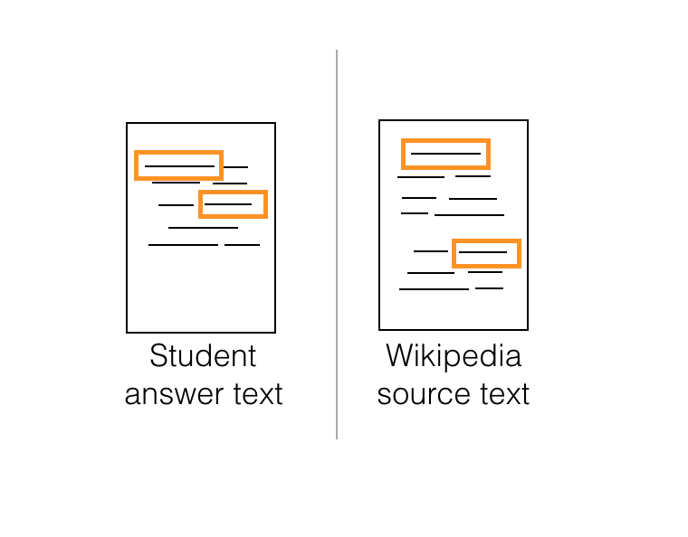

# Plagiarism Detection Project

In this project, you will be tasked with building a plagiarism detector that examines a text file and performs binary classification; labeling that file as either _plagiarized_ or _not_, depending on how similar that text file is to a provided source text. Detecting plagiarism is an active area of research; the task is non-trivial and the differences between paraphrased answers and original work are often not so obvious.

Later in this lesson, you'll find a link to all of the relevant project files.

## Defining Features

One of the ways you might go about detecting plagiarism, is by computing **similarity features** that measure how similar a given text file is as compared to an original source text. You can develop as many features as you want and are required to define a couple as outlined in [this paper](https://s3.amazonaws.com/video.udacity-data.com/topher/2019/January/5c412841_developing-a-corpus-of-plagiarised-short-answers/developing-a-corpus-of-plagiarised-short-answers.pdf) (which is also linked in the Lesson Resources tab. In this paper, researchers created features called **containment** and **longest common subsequence**.

In the next few sections, which explain how these features are calculated, I'll refer to a submitted text file (the one we want to label as plagiarized or not) as a **Student Answer Text** and an original, wikipedia source file (that we want to compare that answer to) as the **Wikipedia Source Text**.

You'll be defining a few different similarity features to compare the two texts. Once you've extracted relevant features, it will be up to you to explore different classification models and decide on a model that gives you the best performance on a test dataset.

# Containment

One of your first tasks will be to create **containment** features that first look at a whole body of text (and count up the occurrences of words in several text files) and then compare a submitted and source text, relative to the traits of the whole body of text.
[Video](https://youtu.be/FwmT_7fICn0)

## Calculating containment

You can calculate n-gram counts using count vectorization, and then follow the formula for containment:

count(n-gram)A∩count(n-gram)Scount(n-gram)A \\frac{{count(\\text{n-gram})}\_{A} \\cap count (\\text{n-gram})\_{S}}{count(\\text{n-gram})\_{A}} count(n-gram)A​count(n-gram)A​∩count(n-gram)S​​

If the two texts have no n-grams in common, the containment will be 0, but if all their n-grams intersect then the containment will be 1. Intuitively, you can see how having longer n-gram's in common, might be an indication of cut-and-paste plagiarism.

# Longest Common Subsequence
[Video](https://youtu.be/yxXXwBKeYvU)

# Dynamic Programming
[Video](https://youtu.be/vAwu-sW9GJE)
